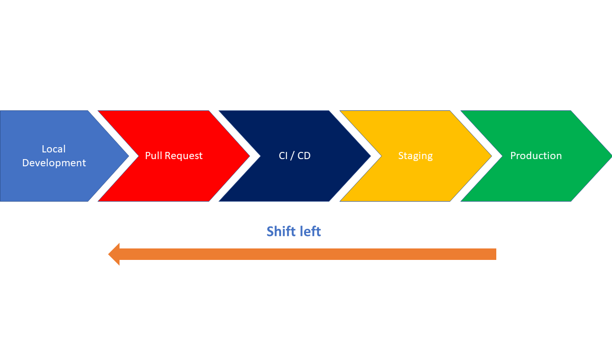
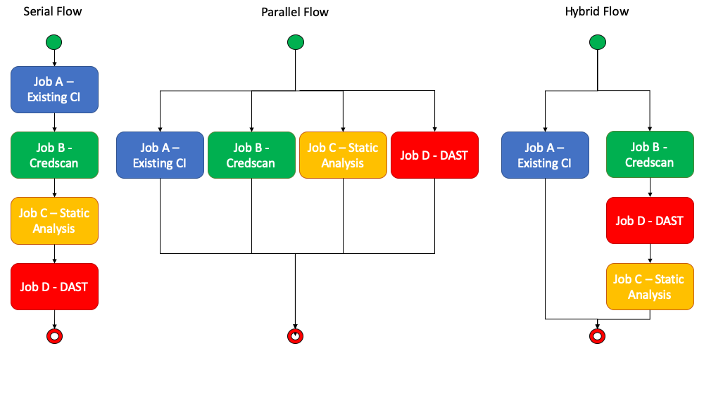
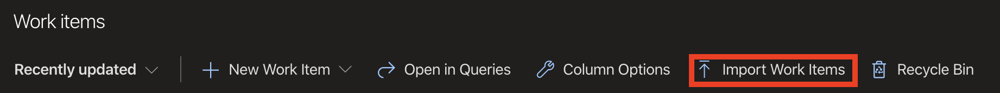

# DevSecOps Packaged Sprint

## Prerequisite knowledge

### The concept of DevSecOps

Pull requests are a central activity in adopting Git and Agile based workflows that leverage Continous Integration (CI). DevSecOps seeks to shift security left and introduces several scenarios/processes/tools needed to have broad security coverage. These additional scenarios during CI can have an impact on developer productivity. This scenario seeks to improve/optimize workflow during Pull Requests.

### Shift Left

In the past, where teams were in a waterfall development model, security testing tended to occur during late testing/staging phases of the development lifecycle. The concept of shifting left is to move the security testing to an earlier stage of development to get feedback more quickly.  In an agile delivery model that leverages Git as the version control platform, the pull request becomes a central activity for shifting tasks left and earlier in the cycle.

Generally, we will seek to shift most of the scenarios around DevSecOps into CI that runs as part of pull request automation as it helps:

* Security Quality Gates integrated with CI
* Stops some vulnerabilities from ever making it to the master branch
* Centralize vulnerability discovery and reporting for development teams
* Empower developers to deliberately suppress false positives as appropriate (Optional) and have those decisions remain part of history in the source code

## WorkFlow patterns

We have developed three options for including DevSecOps scenarios into your applications development workflow.  These options provide flexibility based on not only the desired security analysis but also the resources and time needed to execute them.  Our recommendation for optimal performance is to have an agent pool with parallel job size >= 5.  The hybrid scenario works best with 2-3 parallel jobs and the serial flow is built for the scenario where you only have access to one agent and CI execution time is not a concern or not addressable.  To adjust the number of parallel jobs, review the documentation [here](https://docs.microsoft.com/en-us/azure/devops/pipelines/licensing/concurrent-jobs?view=azure-devops).

### Serial Flow

If you have a flow that you need to execute one by one, use the Serial folow pattern.  Fully implemented this pipeline will take approxiamately 30 minutes to fully execute on average.

### Parallel Flow

If you don't need to execute the tasks serially, you can use the parrllel flow. This can greatly reduce execution time to 5-7 minutes.

### Hybrid Flow

Hybrid flow is a compromise on parallel jobs where you continue to run CI in its own pipeline but delegate all DevSecOps task to a secondary pipeline.  The benefit of this model is you can apply org policy effectively and reuse the DevSecOps across projects with minimal modifications potentially.  Execution time can very but is generally around 12 minutes in our test scenario.

## Setting up the packaged sprint in your project

The goal of the packaged sprint is to provide an efficient and flexible way to Shift Left in your project. The Packaged Sprint consists of a spreadsheet containing an Epic, Features, User Stories, and Tasks, which, when imported in ADO, will help your team make choices on what fits your specific project.

Begin by importing the spreadsheet into your ADO Project to start the team on this exciting journey! Just look for the "Import Work Items" on the Boards page of ADO and import the PackagedSprint.csv file included with the packaged sprint materials. More details on importing can be found [here](https://docs.microsoft.com/en-us/azure/devops/boards/queries/import-work-items-from-csv?view=azure-devops#import-new-work-items).

## New Items Created

The packaged sprint csv will add an Epic to your project that includes the following (6) Features:

* Select a Workflow for DevSecOps
* Workflow
* Credential and Secret Scanning
* Dependency and Container Scanning
* Penetration Testing
* Static Code Analysis
* Enforce Org Security Policy

These features offer a selection of stories that will drastically improve feedback to engineers allowing the team to make smart choices about security early in the development process.

## Next Steps

After importing the Packaged Sprint it is paramount that the team understand the purpose of the Epic and review Features and Stories during planning. Some choices have to be made on any stories that aren't a fit for the project, if the selection of tooling called out by the CSE DevOps team are the right choices for your project, and prioritization of the work. Start with the Feature "Select a worflow for DevSecOps" which will help move the team forward by deciding what and how to Shift Left.
