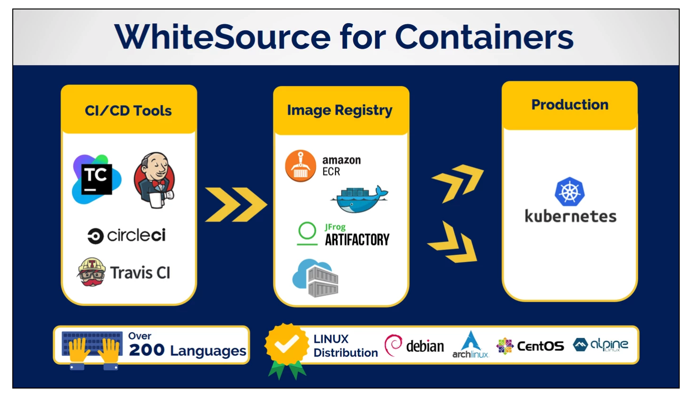

# Whitesource Container Scanning
# Status: In Development



## Requirements for Azure Container Registry Usage
- Authorized account to Azure Container Registry
- Permissions for image pulling from Azure Container Registry
- Docker installed

Download the Unified Agent and Configuration File
- [WS Agent](https://github.com/whitesource/fs-agent-distribution/raw/master/standAlone/whitesource-fs-agent.jar%22)
- [WS Configuration](https://github.com/whitesource/fs-agent-distribution/raw/master/standAlone/whitesource-fs-agent.config)

*Notes:*
- [WS configuration reference](https://whitesource.atlassian.net/wiki/spaces/WD/pages/489160834/Unified+Agent+Configuration+File+Parameters) contains details about the parameters found in the config file. 

## Configuration Changes

Search the configuration for the "SCAN MODE: Docker images" heading. The entries in this section will need to be uncommented and updated as appropriate for your config. See the configuration reference link above for more details.

*Sample Configuration*
```
    ...
     
    docker.includes=.*.* 
    docker.scanImages=true
    docker.pull.enable=true
    docker.azure.enable=true
    docker.azure.userName=ImTheUser
    docker.azure.userPassword=ThIsDoEsNoTSeEmSeCuRe
    docker.azure.registryName=myazureregistry

    #this configuration will scan all of your docker images (as well as configured package manger scans) in this registry. 

    ...
```
*Login to Azure*
```
 $ az login -u <username> -p <password>
```

*Run the Unified Agent*

```
 $ java -jar whitesource-fs-agent.jar -apiKey <api-key-for-ws> -c <path:ws-configuration>
```