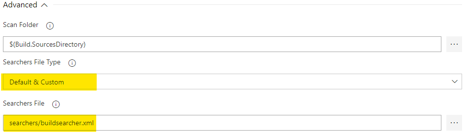
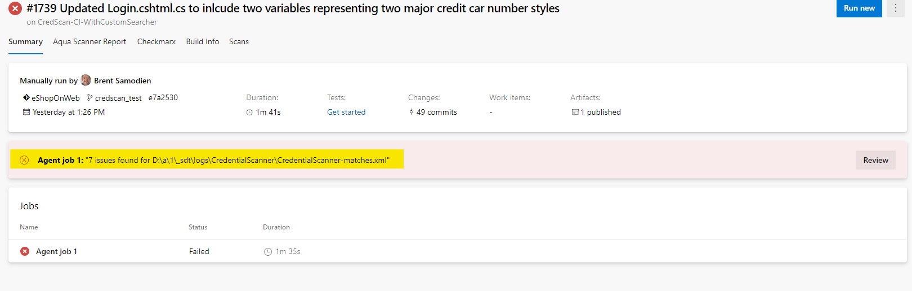
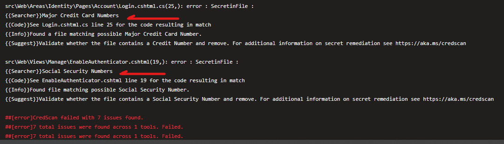

# CredScan Custom Searchers

The CredScan tool comes with many built in scanners and the list of
scanners keep growing in order to support all of the industry standard
ways that credentials are often represented in code and files related to
your project. So it is recommended that you review the available
searchers and by reaching out to <credscancore@microsoft.com> if you
need additional scanners to be added to the tool.

## Defining Your Own Searcher
---

There are Scnarios that you may want to implement your own searcher in
order to identify patterns of secrets that you may be aware of kreeping
in to your code and associated files.

A content searcher is defined as follows and can be saved in an xml file
which you can use either in the client side tooling or in the Azure
DevOps Extension:

| **Property**                  | **Description**                                                                                                                                                                                                                                                                                                                                                                                                                                                                                                                                         |
|-------------------------------|---------------------------------------------------------------------------------------------------------------------------------------------------------------------------------------------------------------------------------------------------------------------------------------------------------------------------------------------------------------------------------------------------------------------------------------------------------------------------------------------------------------------------------------------------------|
| **Name**                      | The descriptive searcher name to be used in CredScan output file. It is recommended to use camel case naming convention for searcher names.                                                                                                                                                                                                                                                                                                                                                                                                             |
| **RuleId**                    | The stable opaque id of the searcher. CredScan default searchers are assigned with the RuleIds like CSCAN0010, CSCAN0020, CSCAN0030, etc. The last digit is reserved for potential searcher regex group merging or division. RuleId for customized searchers should have its own namespace in the format of: CSCAN-{Namespace}0010, CSCAN-{Namespace}0020, CSCAN-{Namespace}0030, etc. The fully qualified searcher name is the combination of the RuleId and the searcher name, e.g. CSCAN0010.KeyStoreFiles, CSCAN0020.Base64EncodedCertificate, etc. |
| **ResourceMatchPattern**      | Regex of file extensions to check against searcher.                                                                                                                                                                                                                                                                                                                                                                                                                                                                                                     |
| **ContentSearchPatterns**     | Array of strings containing Regex statements to match. If no search patterns are defined, all files matching the resource match pattern will be returned                                                                                                                                                                                                                                                                                                                                                                                                |
| **ContentSearchFilters**      | Array of strings containing Regex statements to filter searcher specific false positives                                                                                                                                                                                                                                                                                                                                                                                                                                                                |
| **Matchdetails**              | Provides the info field content for a match using Prefast report format.                                                                                                                                                                                                                                                                                                                                                                                                                                                                                |
| **Recommendation**            | Provides the suggestions field content for a match using Prefast report format.                                                                                                                                                                                                                                                                                                                                                                                                                                                                         |
| **Severity**                  | Provides the rank field content for a match using Prefast output.                                                                                                                                                                                                                                                                                                                                                                                                                                                                                       |
| **SearchValidatorClassName** | (Optional) Provides the fully qualified name of a post matching validator class which implements Microsoft.Art.ContentSearch.ISearchValidator interface. Complex validation logic beyond Regex matching can be implemented in this class. (e.g. To verify a base64 encoded string match can be deserialized as a certificate object which contains private key)                                                                                                                                                                                         |

## Example Implementing Custom Searchers to Filter out Social Security Numbers and Credit Cards 
---

The example below demonstrates creating a file that can be passed to the
CredScan tool as an argument. The Custom scanner will be appended to the
Default scanner at runtime to insure scans for the new content search
patters are available.

~~~~~
<?xml version="1.0" encoding="utf-8"?>
<ArrayOfContentSearcher xmlns:xsi="http://www.w3.org/2001/XMLSchema-instance" xmlns:xsd="http://www.w3.org/2001/XMLSchema">
<ContentSearcher>
    <Name>Social Security Numbers</Name>
    <RuleId>CSCAN0170</RuleId>
    <ResourceMatchPattern>
        \\.(cs|xml|config|json|ts|cfg|txt|ps1|bat|cscfg|publishsettings|cmd|psm1|aspx|asmx|vbs|added\_cluster|clean|pubxml|ccf|ini|svd|sql|c|xslt|csv|FF|ExtendedTests|settings|cshtml|template|trd|argfile)$|(config|certificate|publish|UT)\\.js$|(commands|user|tests)\\.cpp$
    </ResourceMatchPattern>
    <ContentSearchPatterns>
        <string>(?!219-09-9999|078-05-1120)(?!666|000|9\\d{2})\\d{3}-(?!00)\\d{2}-(?!0{4})\\d{4}</string>
    </ContentSearchPatterns>
    <MatchDetails>Found file matching possible Social Security Number.</MatchDetails>
    <Recommendation>
        Validate whether the file contains a Social Security Number and remove. For additional information on secret remediation see https://aka.ms/credscan 
    </Recommendation>
    <Severity>3</Severity>
</ContentSearcher>
<ContentSearcher>
    <Name>Major Credit Card Numbers</Name>
    <RuleId>CSCAN0180</RuleId>
    <ResourceMatchPattern>
        \\.(cs|xml|config|json|ts|cfg|txt|ps1|bat|cscfg|publishsettings|cmd|psm1|aspx|asmx|vbs|added\_cluster|clean|pubxml|ccf|ini|svd|sql|c|xslt|csv|FF|ExtendedTests|settings|cshtml|template|trd|argfile)$|(config|certificate|publish|UT)\\.js$|(commands|user|tests)\\.cpp$
    </ResourceMatchPattern>
    <ContentSearchPatterns>
        <string>((67\\d{2})|(4\\d{3})|(5\[1-5\]\\d{2})|(6011))(-?\\s?\\d{4}){3}|(3\[4,7\])\\d{2}-?\\s?\\d{6}-?\\s?\\d{5}</string>
    </ContentSearchPatterns>
    <MatchDetails>Found a file matching possible Major Credit Card Number.</MatchDetails>
    <Recommendation>
        Validate whether the file contains a Credit Number and remove. For additional information on secret remediation see
        https://aka.ms/credscan </Recommendation>
    <Severity>3</Severity>
</ContentSearcher>
</ArrayOfContentSearcher>
~~~~~

The xml content above can be saved in a file e.g. “buildsearcher.xml”
and saved in a convenient location so that it can be used in your Azure
DevOps pipeline.

## Using a Custom Searcher in the CredScan Azure Devops Extension
---

In the Advanced section of the CredScan Azure DevOps Task, Make the
following Selections:

1.  Set the Searcher File Type Property to “Default & Custom”

2.  Set the Searcher File Property to “<Location of your custom
    buildsearcher.xml file>” (Try to store this file in Blob Storage
    and retrieve it during pipeline execution. This way it does not need
    to be embedded manually in every project)

Now you can configure that Match Results for your new Custom scanner
causes your build to break and you can receive some useful feedback with
respect to where the patterns were matched

Details Reflected in the logs below

