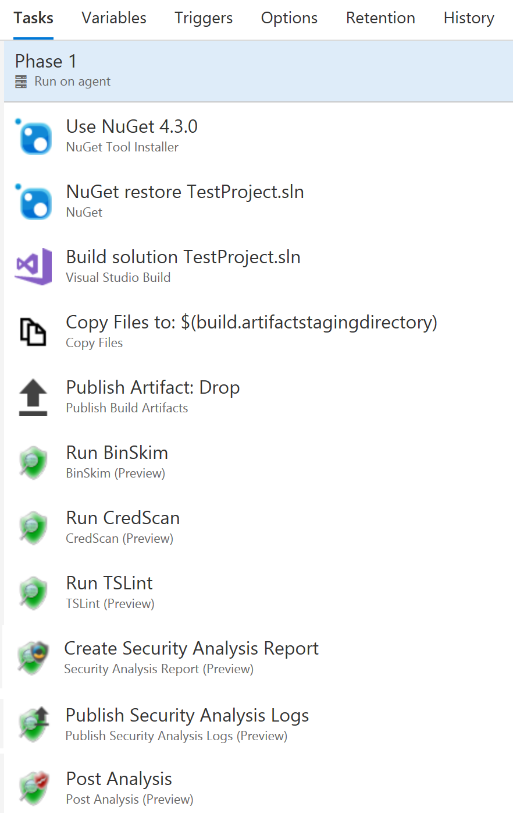

# Installation & Configuration

## External Links

- [CredScan Install](https://secdevtools.azurewebsites.net/helpcredscan.html)

- [Post Analysis Setup](https://secdevtools.azurewebsites.net/helpPostAnalysis.html)

- [1eswiki](https://www.1eswiki.com/wiki/CredScan_Azure_DevOps_Build_Task)

-[CESec Engineering](https://microsoft.sharepoint.com/teams/CESecEngineering/CredScan/CredScan%20Wiki/Home.aspx)

## NOTES

CredScan by itself in a pipeline will not be useful.  You need to add in analysis and publish tasks to make the tool output meaningful.

