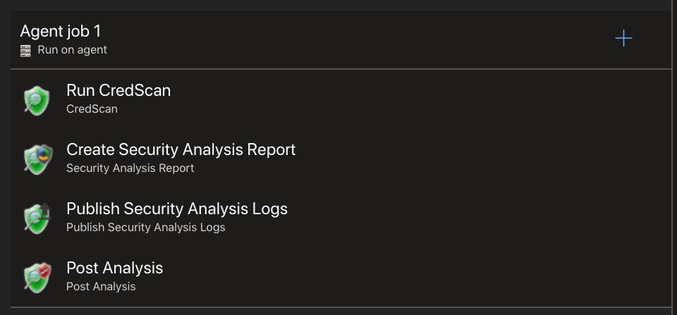

# Installation & Configuration

First you need to [request access](./RequestAccessAndInstall.md).

Once you have installed the extension into the org, you can start to add components into the pipeline.  You need to add the following four components in order to have an effective pipeline.

- CredScan
  - You can use a suppression file if you have created one.  See [Suppressions](./Suppressions.md) for guidance.

- Create Security Analysis Report
  - Ensure CredScan is checked under tools parameter

- Publish Security Analysis Logs
  - Ensure CredScan is checked under tools parameter

- Post Analysis
  - Ensure CredScan is checked under tools parameter

**NOTE:** Once CredScan is installed you can also prevent users from pushing code with credentials to the repo by enabling

## External Links

- [CredScan Install](https://secdevtools.azurewebsites.net/helpcredscan.html)

- [CredScan Overview](https://strikecommunity.azurewebsites.net/articles/4114/credential-scanner-overview.html)

- [Post Analysis Setup](https://secdevtools.azurewebsites.net/helpPostAnalysis.html)

- [1eswiki](https://www.1eswiki.com/wiki/CredScan_Azure_DevOps_Build_Task)

- [CESec Engineering](https://microsoft.sharepoint.com/teams/CESecEngineering/CredScan/CredScan%20Wiki/Home.aspx)
