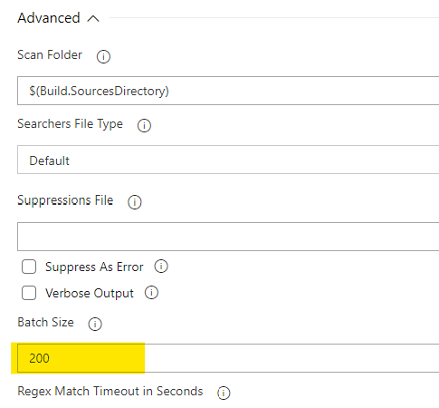
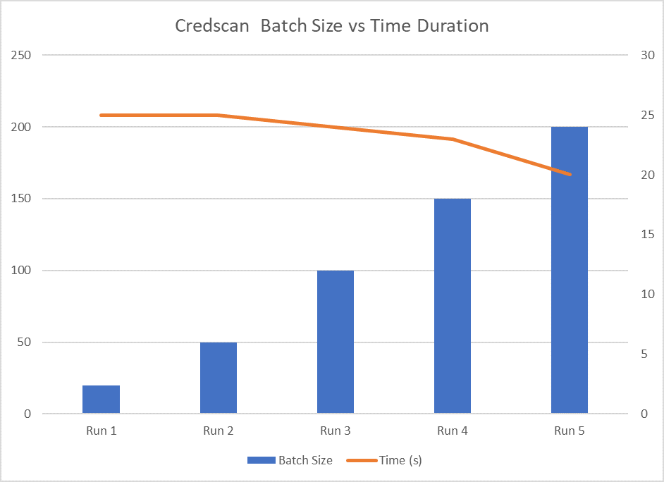

# Tuning CredScan

When using CredScan on large code bases, you have the option to improve performance through the available configuration options.  Small code bases may not see much impact from changing the defaults.

## Scanner Performance

There are a number of things that can be done in order to tune the performance of the CredScan tooling. The options in the table below can be used in both the Client executable that can be imported to the Azure DevOps agent and be executed from the Command line or alternatively it can be used with the Installed Azure DevOps Task.

## Configuration Options

| **Name** | **Description** | **Default Value** |
| --- | --- | --- |
| **BatchSize** | Number of searchers to run in parallel | 20 |
| **FileScanReadBufferSize** | Buffer size while reading content in bytes | 524288 |
| **MaxFileScanReadBytes** | Maximum number of bytes to read from a given file during content analysis | 104857600 |
| ​**RegexMatchTimeoutInSeconds** | ​​​​​Regex matching timeout in seconds. | 300​ (5 minutes)​ |

## Average Scan Result Time Improvement with Different Setting for Batch Size

The data below shows of how the change in batch size can positively influence execution times. When execution times are already negligible and for small code bases, changing the batch size may have a disproportionate results when comparing batch size to time gained. The effect is measurably different for bigger code bases where parallelism show execution time improvement.

|   | Run 1 | Run 2 | Run 3 | Run 4 | Run 5 |
| --- | --- | --- | --- | --- | --- |
| **Batch Size** | 20 | 50 | 100 | 150 | 200 |
| **Time (s)** | 25 | 25 | 24 | 23 | 20 |

