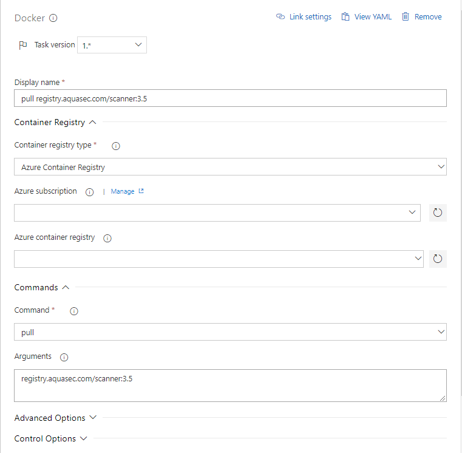
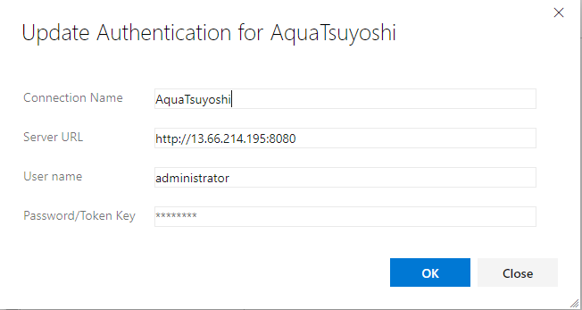

# Aqua installation and configuration 

This article explains, how to configure Aqua with Azure Kubernetes Service with Azure Container registry, 
and Azure DevOps pipeline. 

# Prerequiste 

* Azure Kubernetes Services up and running 
* Azure Container Registry running
* Azure DevOps Project 
* Azure CLI

# Aqua on Kubernetes 

You can find the documentation. This document adopt it to Azure Kubernetes Service

* [Kubernetes - Aqua](https://docs.aquasec.com/docs/std-deployment-kubernetes)

## Get the credentials of k8s

```
$ az login
$ az aks get-credentials -n <YOUR CLUSTER NAME> -g <RESOURCE GROUP NAME>
```

## Create a security

```
$ kubectl create namespace aqua-security
```

### Create a secret for Aqua Registry

NOTE: Not your Container registry. It is aqua registry. 

Create a secret on the K8s. You need to use the username/password to login https://my.aquasec.com.

```
$ kubectl create secret docker-registry aqua-registry --docker-server=registry.aquasec.com --docker-username=<Aquq Username>  --docker-password=<Aquq Password> --docker-email=no@email.com -n aqua-security
```

## Create a Service account 

```
kubectl create -n aqua-security -f - <<EOF
apiVersion: v1
kind: ServiceAccount
metadata:
  name: aqua
imagePullSecrets:
- name: aqua-registry
EOF

```

## Create a YAML file 

for deploying Aqua Server, Database and Gateway. Aquq use PostgreSQL on the k8s cluster. 

```
apiVersion: v1
kind: Service
metadata:
  name: aqua-db
  labels:
    app: aqua-db
spec:
  ports:
    - port: 5432
  selector:
    app: aqua-db
---
apiVersion: extensions/v1beta1
kind: Deployment
metadata:
  name: aqua-db
spec:
  template:
    metadata:
      labels:
        app: aqua-db
      name: aqua-db
    spec:
      serviceAccount: aqua
      containers:
      - name: aqua-db
        image: registry.aquasec.com/database:4.0
        env:
          - name: POSTGRES_PASSWORD
            valueFrom:
              secretKeyRef:
                name: aqua-db
                key: password
        volumeMounts:
          - mountPath: /var/lib/postgresql/data
            name: postgres-db
        ports:
        - containerPort: 5432
      volumes:
        - name: postgres-db
          hostPath:
            path: /var/lib/aqua/db
---
apiVersion: v1
kind: Service
metadata:
  name: aqua-gateway
  labels:
    app: aqua-gateway
spec:
  ports:
    - port: 3622
  selector:
    app: aqua-gateway
---
apiVersion: extensions/v1beta1
kind: Deployment
metadata:
  name: aqua-gateway
spec:
  template:
    metadata:
      labels:
        app: aqua-gateway
      name: aqua-gateway
    spec:
      serviceAccount: aqua      
      containers:
      - name: aqua-gateway
        image: registry.aquasec.com/gateway:4.0
        env:
          - name: SCALOCK_GATEWAY_PUBLIC_IP
            value: aqua-gateway
          - name: SCALOCK_DBUSER
            value: "postgres"
          - name: SCALOCK_DBPASSWORD
            valueFrom: 
              secretKeyRef:
                name: aqua-db
                key: password
          - name: SCALOCK_DBNAME
            value: "scalock"
          - name: SCALOCK_DBHOST
            value: aqua-db
          - name: SCALOCK_DBPORT
            value: "5432"
          - name: SCALOCK_AUDIT_DBUSER
            value: "postgres"
          - name: SCALOCK_AUDIT_DBPASSWORD
            valueFrom: 
              secretKeyRef:
                name: aqua-db
                key: password
          - name: SCALOCK_AUDIT_DBNAME
            value: "slk_audit"
          - name: SCALOCK_AUDIT_DBHOST
            value: aqua-db
          - name: SCALOCK_AUDIT_DBPORT
            value: "5432"
        ports:
        - containerPort: 3622
---
apiVersion: v1
kind: Service
metadata:
  name: aqua-web
  labels:
    app: aqua-web
spec:
  ports:
    - port: 443
      protocol: TCP
      targetPort: 8443
      name: aqua-web-ssl
    - port: 8080
      protocol: TCP
      targetPort: 8080
      name: aqua-web

  selector:
    app: aqua-web
  type: LoadBalancer    
---
apiVersion: extensions/v1beta1
kind: Deployment
metadata:
  name: aqua-web
spec:
  template:
    metadata:
      labels:
        app: aqua-web
      name: aqua-web
    spec:
      serviceAccount: aqua
      containers:
      - name: aqua-web
        image: registry.aquasec.com/console:4.0
        env:
          - name: SCALOCK_DBUSER
            value: "postgres"
          - name: SCALOCK_DBPASSWORD
            valueFrom:
              secretKeyRef:
                name: aqua-db
                key: password
          - name: SCALOCK_DBNAME
            value: "scalock"
          - name: SCALOCK_DBHOST
            value: aqua-db
          - name: SCALOCK_DBPORT
            value: "5432"
          - name: SCALOCK_AUDIT_DBUSER
            value: "postgres"
          - name: SCALOCK_AUDIT_DBPASSWORD
            valueFrom: 
              secretKeyRef:
                name: aqua-db
                key: password
          - name: SCALOCK_AUDIT_DBNAME
            value: "slk_audit"
          - name: SCALOCK_AUDIT_DBHOST
            value: aqua-db
          - name: SCALOCK_AUDIT_DBPORT
            value: "5432"
        volumeMounts:
          - mountPath: /var/run/docker.sock
            name: docker-socket-mount
        ports:
        - containerPort: 8080
      volumes:
        - name: docker-socket-mount
          hostPath:
            path: /var/run/docker.sock
```

Once create the YAML file, apply it. 

```
kubectl create -f aqua-server.yaml -n aqua-security
```

# Configure the Dashboard 

After the deployment, You can see the aqua-web external ip-address. In this case, the IP address is `13.66.214.195`, please change the address to your enviornment. 

```
$ kubectl get service aqua-web -n aqua-security
NAME       TYPE           CLUSTER-IP   EXTERNAL-IP     PORT(S)                        AGE
aqua-web   LoadBalancer   10.0.94.99   13.66.214.195   443:30029/TCP,8080:30734/TCP   1m
```

Go to the `http://13.66.214.195:8080` for the HTTP access in this case. You requested administrator passowrd then you will see the this screen.


Copy the token from the https://my.aquasec.com and paste on this screen. 


Now you can see the dashboard. 

# Configure Azure Container Registry integration 

You can refer this document if you are interested. 
* [Image Vulnerability Scanning in Azure Container Registry](https://blog.aquasec.com/image-vulnerability-scanning-in-azure-container-registry)

Go to the aqua dashborad, System > integration 


Input the value of the Container Registry, then Save Changes > Test Connection. 


Then Go to Images, push `ADD IMAGES` 


## Security report 

You will see various Security report on your k8s cluster. In this case, `http://13.66.214.195:8080` enter username as administrator and password you specified. 


# Configure CI pipeline with Azure DevOps

Create a pipeline with Linux based hosted agent. e.g. Hosted Ubuntu 1604.  The pipeline is created by for tasks. 

* Build a target image 
* Login to the Aqua registry
* Pull the scanner image
* Scan the image


## Build a target image

Build your docker image on this task. Don't forget to add tag.  The container registry settings is for your Container Registry. DockerHub or Azure Container Registry. 


Click Manage link and configure the host/username/password.


## Loginto the Aqua registry

Login to the Aqua registry. The container registry settings is for the Aqua registry.


 Click Manage link and configure it. The username/password is for the my.aquqsec.com of yours.

 
## Pull the scanner image 

Donwload the scannar image. It is coming from Aqua registry. 



## Scan the image 

Docker task (build) automatically add the Azure Container Registry hostname as a prefix of the image. Also, it requires version tag. 


Also, you need to configure Aqua Management Console Connection. This is for the console which you created already on the kubernetes cluster. 
set the IP address from k8s and username is administrator by default, and put the password you specified on it. 



# Security report. 

## Pipeline report

You can see the report on the Pipeline result on Azure DevOps. 


## Dashboard report

You will see various Security report on your k8s cluster. In this case, `http://13.66.214.195:8080` enter username as administrator and password you specified. 

Go to 
