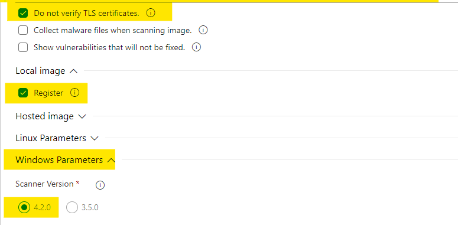

# Aqua Security Configuration

## Install Aqua on AKS

If you are not using the Azure Hosted Marketplace Virtual Machine for your Aqua Server environment. You can optionally install Aqua directly into a Kubernetes environment.

Instructions [here](./InstallAquaOnAKS.md)

## View the dashboard

To view the administrator dashboard, from a browser window,navigate to  `http://<dns of public IP in Aqua RG>:8080` and provide the license token for your environment as depicted below.

This token can be retrieved from <https://my.aquasec.com> and pasted in the area provided on this screen.

The Aqua dashboard will be displayed which will provide you with configuration options for your instance.

### Configure Azure Container Registry integration

If you are interested in integrating the scanner with your existing ACR so that you can scan existing containers you can refer to the link below:

  [Image Vulnerability Scanning in Azure Container Registry](https://blog.aquasec.com/image-vulnerability-scanning-in-azure-container-registry)

In the Aqua left menu select:
  **System > integration**

Input the value of the Container Registry, click Save changes > Test Connection.

Then to scan the images in the registry, click `ADD IMAGES`  and scan.

### View Scan Results

After a scan has been concluded. You will see a collection of results alerting you to vulnerabilities found, sensitive information identified and whether or not malware was detected. Some samples are depicted below:

## Configuring Assurance Policies

You will likely notice that even though vulnerabilities are found, the Image is reflected as "Approved". In order to have the correct behavior in your Azure DevOps pipeline (i.e break a build when vulnerabilities are found) it is important, to at the very least configure assurance policies.

In the Aqua dashboard, using the left navigation menu,  click on Policies -> Assurance Policies and Select the Default Image Policy as depicted below:

In the **Controls** sub-menu, select **Vulnerability Severity** and decide which level level is in-line with your policy.

## Configure the Aqua Task in a CI pipeline in Azure DevOps

Navigate to the address below or search for Aqua security in the Azure DevOps Marketplace.

 [Container Security](https://marketplace.visualstudio.com/items?itemName=aquasec.aquasec)

Once you have installed the extension, create a pipeline with a **Linux based** hosted agent. e.g. Hosted Ubuntu 1604.

The steps that supports this workflow are detailed below:

* Create the necessary service connections
* Create a pipeline that:
  * Builds a target image
  * Login to the Aqua Security registry and pull the Aqua scanner image
  * Scan the target image

**An example YAML pipeline is available in the pipelines folder [here](../../pipelines/Challenge%202/ContainerScanning/Aqua-CI.yml).**

### Create the service connections

You will need to create three (3) [service connections](https://docs.microsoft.com/en-us/azure/devops/pipelines/library/service-endpoints?view=azure-devops&tabs=yaml) in Azure DevOps.

One to your **Azure Container Registry** (So you can push images that hav been scanned)

The second to the **Aqua Container Registry** (So you can pull the latest scanner image)

The third to your **Aqua Management Console** (So the CI pipeline can update the console with Scan Results)

If the ACR is located in a subscription other than one available to the logged in user, you will need to use `Service Type: Other`.

### Build a target image

Build your docker image in this task. Don't forget to add a tag to uniquely identify the result of a pipeline execution.  Best Practice is to use the BuildId as your image tag.  You will need to setup a service connection to your Azure Container Registry. Provide configuration information for your Container Registry by supplying the address to DockerHub or your private Azure Container Registry.

If you have not pre-configured the service connection to your container registry, click manage link and configure the host,username and password.

### Login to the Aqua Security registry

Supply the log in information for the Aqua Security registry

 If you have not pre-configured the service connection to the Aqua Security registry, click the "Manage" link and follow the configuration instructions, remembering to provide the username/password that you use to log into <https://my.aquqsec.com>.

 

### Pull the scanner image

Download the scanner image from Aqua registry. (The Aqua Security task will use this image to scan the target image for vulnerabilities).

### Scan the target image using the Aqua Security Scanning Task

Please note that the default configuration of the Docker task will append the Azure Container Registry hostname as a prefix to the image name. It is also prudent to insure that an a unique image tag is provided. It is therefore important to match this when configuring the Aqua Security Scanning Task.

If you have not pre-configured the service connection to the Aqua Management Consol, click "Manage" and provide the configuration information for your Aqua management consol.

## Security Vulnerability Reports

### Pipeline Build Output

Once the pipeline has executed, a new tab will be visible names "Aqua Security Report" This tab should provide vulnerability information for the image scanned directly in the pipeline and as a result there is no need to navigate to the Aqua Dashboard to view. It should be noted that this information is also stored in the AquaSec Database in your k8s cluster. The image below depicts a sample pipeline report.

### Dashboard report

To view a history of reports, produced by the tool. Navigate to the AquaSec Portal.

Go to Images > CI/CD Scans. Here you will be able to inspect reports produced as a result of image scans within your build pipeline.

## Windows Container Scanning with CI on a Self-Hosted agent

In order to perform scans on Windows container images in a self hosted environment a few additional configuration steps are require.

TO save time during build executions, install the scanner-cli on the self-hosted agent in advance.  You can download the scanner-cli using the link below.
Download the scanner-cli from scanner-cli (Windows).

### Download and install scanner-cli

* [Windows Scanner CLI Version 4.2](https://download.aquasec.com/windows-scanner/4.2.0/AquaScannerWindowsInstaller.4.2.0.12326.msi)

You will need to provide the installer with the URL of the Aqua DashBoard(on k8s), the Username and password of the Aqua Server when prompted.This can be automated with msiexec if you prefer.

### Integratinq with the Azure DevOps Pipeline

Configure the Task in the same way that it is configured for Linux image scans, expect in the case of the settings depicted below. Bear in mind that you do not need to pull the scanner docker since it may already be installed.

* [Azure DevOps (Microsoft VSTS) Integration](https://docs.aquasec.com/docs/azure-devops-integration)
* [Scanner-CLI](https://docs.aquasec.com/v3.5/docs/command-line)
