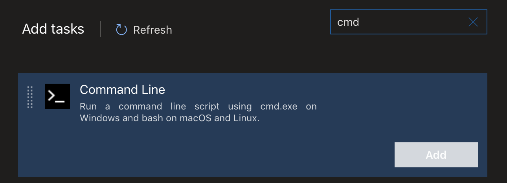
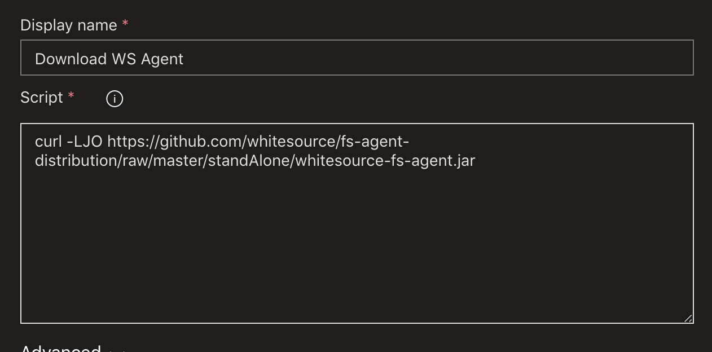
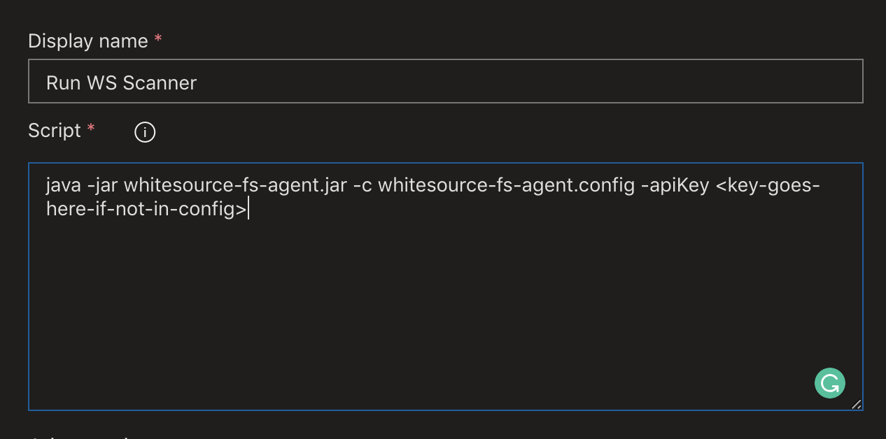

# Add WhiteSource Configuration to Source

With a White Source [account setup](./WhiteSource-Setup.md) we need to add a configuration file to the source code that will be associated with the project. This will need to be done for each repo.

_If a configuration has already been added to your source skip downloading the template and review the configuration as indicated below._ A template configuration for WhiteSource can be found [here](https://s3.amazonaws.com/unified-agent/wss-unified-agent.config) and will need to have several settings altered before being committed to the repository.

## Minimum configuration details

``` shell

    #check policies at the end of the scan. The default is to complete the scan and only report in whitesource inventory.
    #with this option set true we can get feedback into the pipeline and fail the build on best-practice and custom policies.  
    checkPolicies=true
    ...

    #ensure that the url matches your WhiteSource provided url with the /agent endpoint specified
    wss.url=https://saas.whitesourcesoftware.com/agent
    ...

    #The API Key must be provided. It can be explicitly set at runtime, or provided in this config.
    #Privacy of source code is a major deciding factor on location and lean toward setting the apiKey in the pipeline.
    apiKey=

    #projectName or projectToken is required. Both are not accepted in a single configuration and will cause the scan to fail.
    projectName=
    ...
    projectToken=

    #productName and productToken can both be given, but the requirement is for one or the other.
    productName=
    productVersion=
    productToken=
```

With the project's whitesourece config set as described above any policy violations will cause the pipeline to fail. We simply need to create a couple of task in the pipeline that run the scanner. Firstly, we will need to download the scanner into our build agent. In a new or existing pipeline agent add 2 task of the type "CMD".



Configure the first task to download the WhiteSource agent into the build agent.

- Set the display name to something like "Download WS Agent"
- Configure the script as follows:

``` shell
    curl -LJO https://github.com/whitesource/fs-agent-distribution/raw/master/standAlone/whitesource-fs-agent.jar
```



Finally, add the other mentioned "CMD" task and configure it to run the scanner

- Set the display name of the task to something like "Run WS Agent"
- Configure the script as follows:

``` shell
    java -jar whitesource-fs-agent.jar -c <filename>.config -apiKey <api-key>
```

*NOTE:* Although the API key can be added to the configuration file added to the source code repo it is recommended that keys of that type be secured. As a best practice adding the API Key to the pipeline/variable configuration offers better control.



## Run the pipeline

At this point you sould be able to run the WhiteSource scanner and find vulnerable packages with exclusions & inclusions based on best practice (Defaults in whitesource) combined with any customer policies.

With the example configuration above the scanner will check for policies that apply to the project in whitesource. These policies are applied based on the whitesource policy prioritization (project -> product -> organization) with project level policies being the winner overall. This allows applicaiton of policies for a project that override an organization level policy.

## Important Notes

- Scan is prone to failure related to corrupted downloads of wss-agent possibly related to load on download site.
- If there are any issues with the whitesource api then pipeline is slowed significantly. A timeout should be set inline with allowable fault tolerance for the pipeline.
