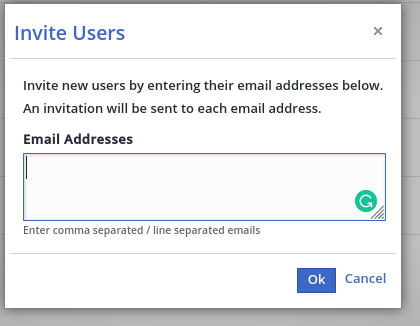
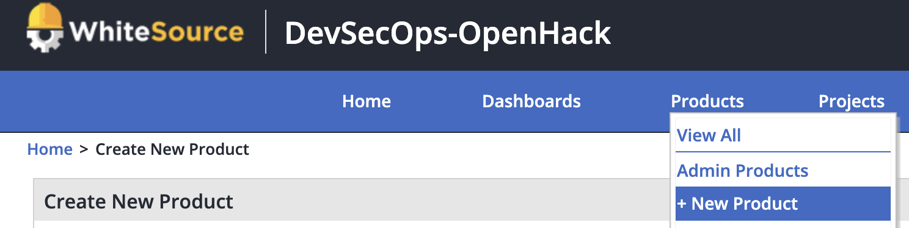
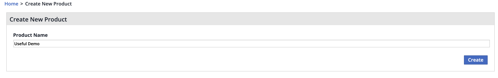
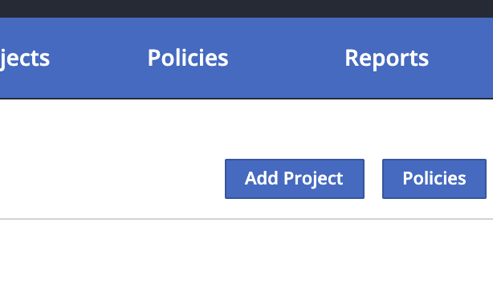
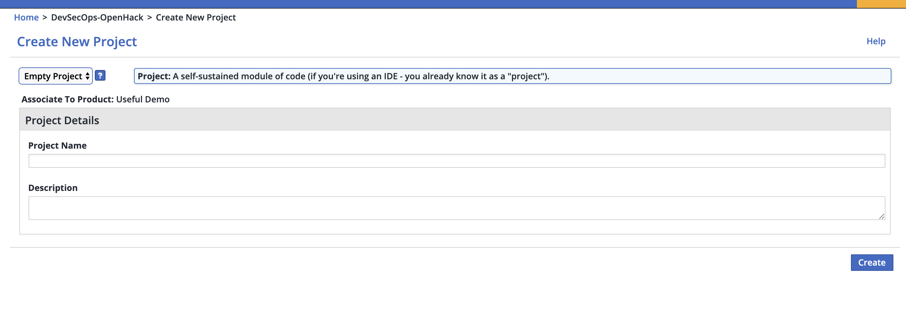
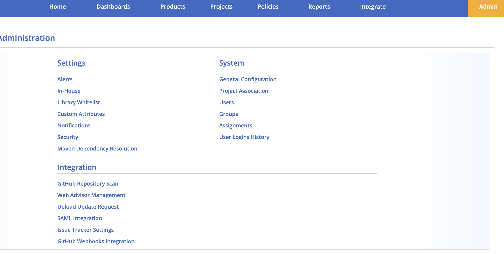
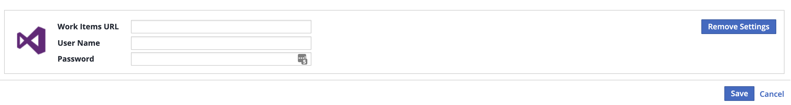
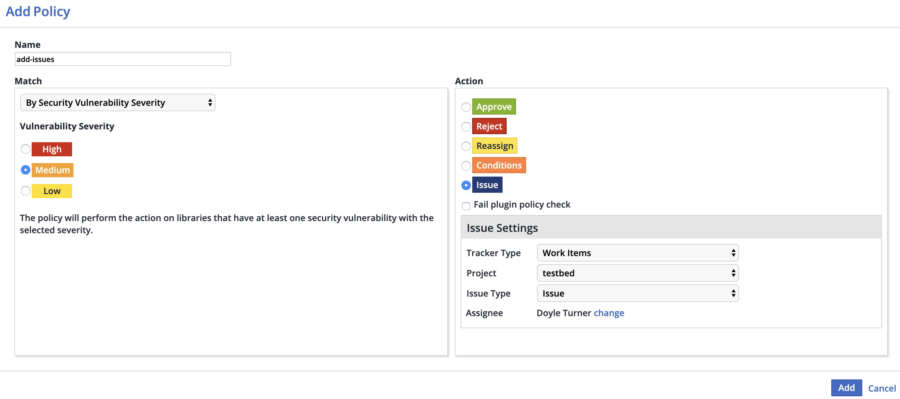

# WhiteSource account/trial required

    - Account login creds are required for the following work. 
    - Additional users or Admins can be added by designated account admin. 
    - In order to create and use the scanner in a pipeline we will need a “Product” and “Project” in WhiteSource to associate the scan with. 

## Setup

The appropriate user accounts for WhiteSource should be created by a member of the 'admin' group that is availble by default. To Create those users, navigate to the "Admin" page using the bright yellow button on the right side of the navigation bar in the WhiteSource portal.

### Add Users

Users can be created by:

1. Click the 'Users' option found under the "System" heading in WhiteSource admin
2. Near the top of the user page click "Invite Users"
3. In the popup add a comma seperated list of user emails you would like to invite.

Each user will receive an email inviting them to create a login for the WhiteSource organization.

### Prep for projects

WhiteSource has a couple of concepts that should be considered and must be implemented prior to configuring pipelines. A “product” acts as a container for a specific product line and within a product multiple “projects” can exist.

To add a new product to WhiteSource find the “Products” link in the main navigation panel at the top of the page in the WhiteSource UI. Under the menu select the “+ New Product” option.

Enter a name for the new product that you would like to create on the next page and click create. This will create the new product under your account and redirect you to the landing page for the new product.

We will need project(s) for tracking attribution of which area within a product a specific code scan belongs to. The Project is required. You may only have one project for a product, but it is more likely that several projects will be required to make up the overall product that is being inventoried. You may loosely think of this as a project for code repo correlation.

On the right side of the project page, just below the navigation panel are several buttons. Furthest to the left in this grouping is the “Add Project” button which is the entry point for creating a new project under the current product.  

Creating the project for scanning is straight-forward. There are just a few options that need to be configured. Note: all of the project creation fields are required.

1. Select “Empty Project” type from the list of project types.
2. Enter the name you wish to use for the project in WhiteSource.
3. Ener a description of the project.

After creating the project, you will be redirected to your main dashboard in WhiteSource. From there you can navigate back into your product or project through the main navigation bar (hover over products and select your product), or through any link on the page that references the product/project by name (various links on the dashboard).

## Shorten the Feedback Loop || Connect Azure DevOps to WhiteSource

To make full use of the scanner we can produce generate work items directly into an Azure DevOps Board. This needs to be configured in the WhiteSource UI. Navigate to the "Admin" tab on the navigation bar and select "Issue Tracker Settings" from the Integration area.

From the Issue Tracker Settings page the Work Items URL and Creds must be provided.  
*NOTE* To add issues to an Azure DevOps Board you will need to create a PAT and give whitesource access to your org/project.  Instructions **[here](https://whitesource.atlassian.net/wiki/spaces/WD/pages/33882353/Issue+Tracker+Integration#IssueTrackerIntegration-WorkItemsIntegration)**.

The final piece of adding work items is to add a policy with the Match set to "By Security Vulnerability" with an appropirate level for your intented failure level and the action set to "Issue". For "Tracker Type" select "Work Items". You should see a list of the available projects to record the issues in based on the credentials provided during the Issue Tracker Settings configuration. You will also need to configure the Issue Type and Assignee on the board. Make sure to save the policy after you are redirected back to the Policy page!

To confgure the policy (can be set at project or product level):

1. Navigate to Whitesource portal
2. Click *Products* or *Project* and select your *product* or *project*
3. Click *Policies* button
4. Click *Add Policy*

