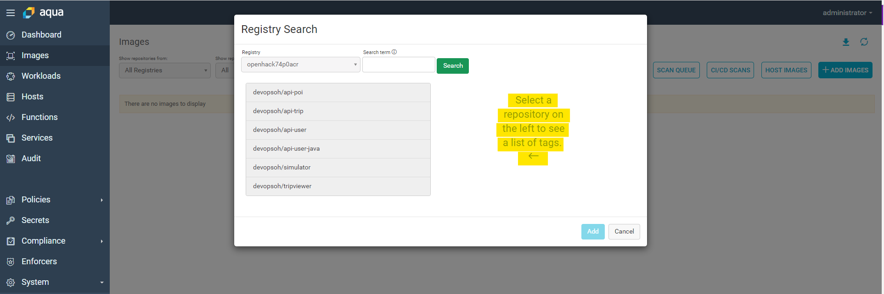
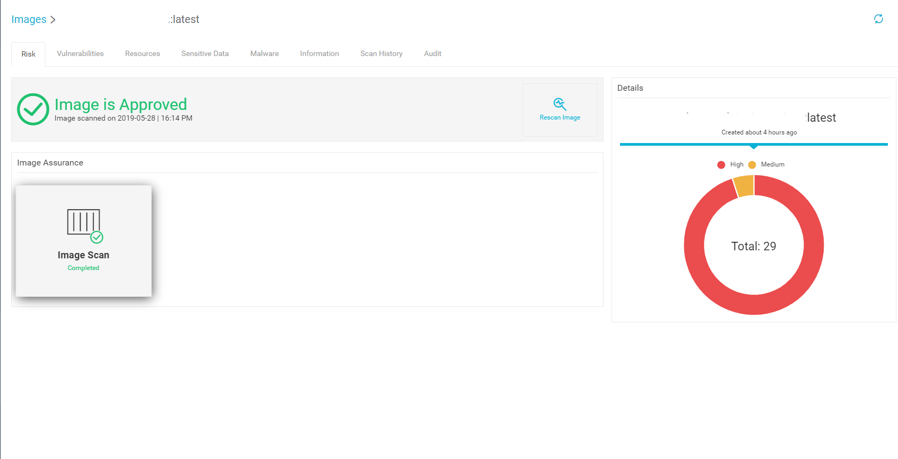
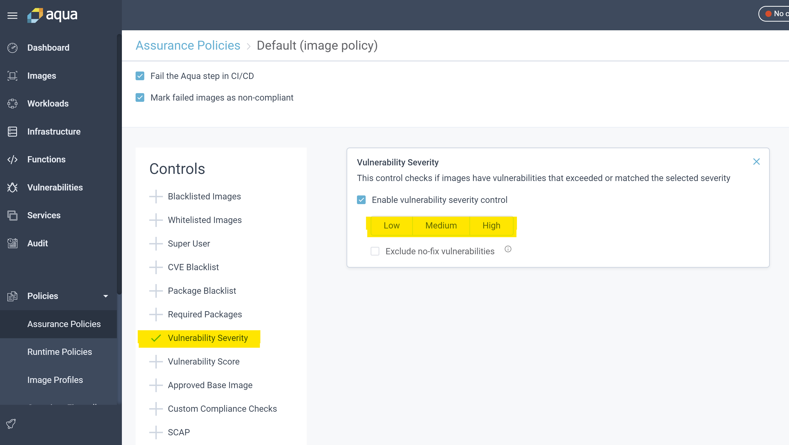
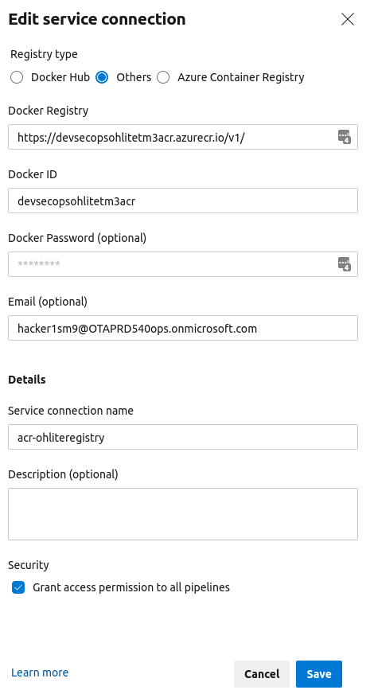
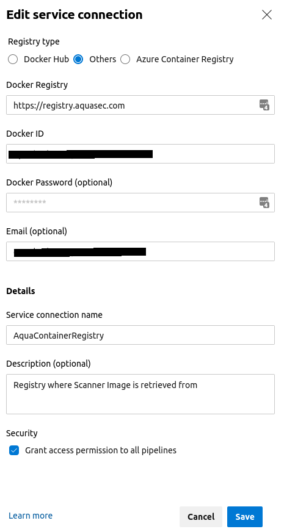

# Aqua Security Configuration

## Installing Aqua

If you do not already have an installation of Aqua - instructions for installing aqua on AKS can be found [here](./InstallAquaOnAKS.md). Additional install options can be found in the [Aqua Documents](https://docs.aquasec.com/docs/deployments-about). The Aqua docs require an account provided by Aquasec.

## Logon to Aqua Instance

To view the administrator dashboard from a browser window navigate to  `http://<dns of public IP in Aqua RG>:8080` and logon to you Aqua instance using the credentials for your AquaSec Management Console

Once successfully logged on. The Aqua dashboard will be displayed which will provide you with configuration options for your instance.

### Configure Azure Container Registry integration

If you are interested in integrating the scanner with your existing ACR so that you can scan existing containers you can refer to the link below:

  [Image Vulnerability Scanning in Azure Container Registry](https://blog.aquasec.com/image-vulnerability-scanning-in-azure-container-registry)

In the Aqua left menu select:
  **System > integration**

Input the value of the Container Registry, click Save changes > Test Connection.

Then to scan the images in the registry, click `ADD IMAGES`  and scan.

### Review Scan Results

After a scan has been concluded the results will alert about vulnerabilities found, sensitive information identified and whether or not malware was detected. Some samples are depicted below:

## Configuring Assurance Policies

You will likely notice that even though vulnerabilities are found, the Image is reflected as "Approved". In order to have the correct behavior in your Azure DevOps pipeline (i.e break a build when vulnerabilities are found) it is important, to at the very least configure assurance policies.

In the Aqua dashboard, using the left navigation menu,  click on Policies -> Assurance Policies and Select the Default Image Policy you would like to set by checking the appropriate checkbox for **Image**.

In the **Controls** sub-menu that appears, select **Vulnerability Severity** and decide which level is in-line with your policy (Low, Medium, Hard).

## Configure the Aqua Task in a CI pipeline in Azure DevOps

Navigate to the address below or search for Aqua security in the Azure DevOps Marketplace.

 [Container Security](https://marketplace.visualstudio.com/items?itemName=aquasec.aquasec)

Once you have installed the extension, create a pipeline with a **Linux based** hosted agent. e.g. Hosted Ubuntu 16.04.

The steps that support this workflow are detailed below:

* Create the necessary service connections
* Create a pipeline that:
  * Builds a target image
  * Logs into the Aqua Security registry and pulls the Aqua scanner image
  * Scans the target image

**An example YAML pipeline is available in the pipelines folder [here](../../pipelines/Challenge%202/ContainerScanning/Aqua-CI.yml).**

### Create the service connections

You will need to create **three (3)** [service connections](https://docs.microsoft.com/en-us/azure/devops/pipelines/library/service-endpoints?view=azure-devops&tabs=yaml) in Azure DevOps.

* One to your **Azure Container Registry** (used to push images that have been scanned).  **NOTE If the ACR is located in a subscription other than one available to the logged in user, you will need to use `Service Type: Other`.**

* The second to the **Aqua Container Registry** (to pull the latest scanner image)

* The third to your **Aqua Management Console** (to allow for the CI pipeline to update the console with Scan Results)

## Security Vulnerability Reports

### Pipeline Build Output

Once the pipeline has executed, a new tab named "Aqua Security Report" will be visible. This tab should provide vulnerability information for the image scanned directly in the pipeline and as a result there is no need to navigate to the Aqua Dashboard to view. It should be noted that this information is also stored in the AquaSec Database in your k8s cluster. The image below depicts a sample pipeline report.

### Dashboard report

To view a history of reports, produced by the tool. Navigate to the AquaSec Portal.

Go to Images > CI/CD Scans. Here you will be able to inspect reports produced as a result of image scans within your build pipeline.

## Windows Container Scanning with CI on a Self-Hosted agent

In order to perform scans on Windows container images in a self hosted environment a few additional configuration steps are require.

To save time during build executions, install the scanner-cli on the self-hosted Windows agent in advance. You can download the scanner-cli using the link below.

### Download and install scanner-cli

* [Windows Scanner CLI Version 4.2](https://download.aquasec.com/windows-scanner/4.2.0/AquaScannerWindowsInstaller.4.2.0.12326.msi)

You will need to provide the installer with the URL of the Aqua DashBoard(on k8s), the Username and password of the Aqua Server when prompted.This can be automated with msiexec if you prefer.

### Integrating with the Azure DevOps Pipeline

Configure the Task in the same way that it is configured for Linux image scans with the following exceptions (also pictured below). Bear in mind that you do not need to pull the scanner from docker if it is already installed.

* Check box "Do not verify TLS certificates
* Check box "Register"
* Select "Scanner Version" = 4.2.0 under "Windows Parameters"

* [Azure DevOps (Microsoft VSTS) Integration](https://docs.aquasec.com/docs/azure-devops-integration)
* [Scanner-CLI](https://docs.aquasec.com/v3.5/docs/command-line)
