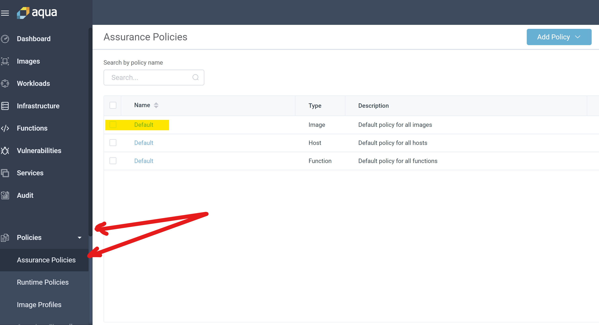
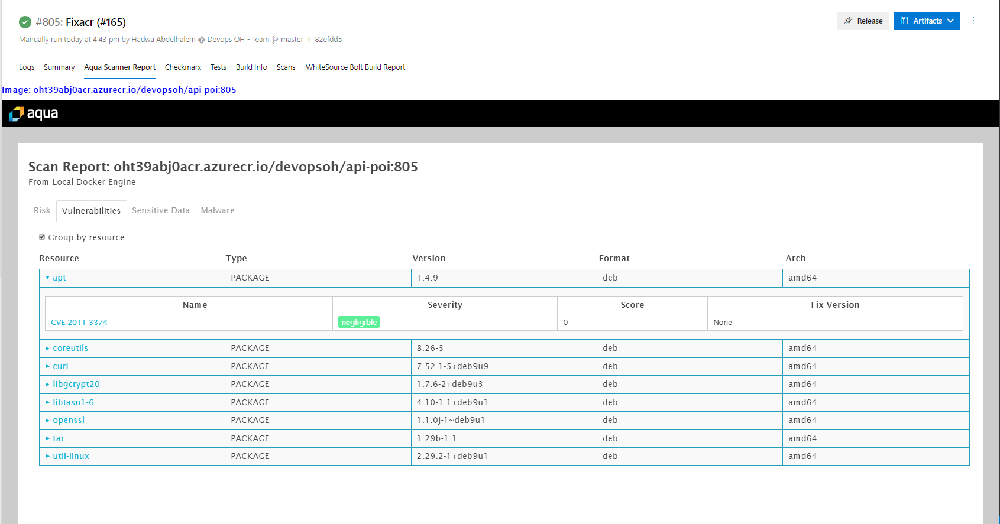

# Aqua Security Configuration

## Installing Aqua

If you do not already have an installation of Aqua - instructions for installing aqua on AKS can be found [here](./InstallAquaOnAKS.md) with additional install options found in the [Aqua docs](https://docs.aquasec.com/docs/deployments-about). **Note** the Aqua docs require an account provided by Aquasec.

## Logon to Aqua Instance

To view the administrator dashboard from a browser window navigate to  `http://<public IP for aqua installation>:8080` and logon to you Aqua instance using the credentials for your AquaSec Management Console.

Once successfully logged on. The Aqua dashboard will be displayed which will provide you with configuration options for your instance.

### Configure Azure Container Registry Integration

Aquasec has provided a nice [blog post](https://blog.aquasec.com/image-vulnerability-scanning-in-azure-container-registry) with insructions on setting up aqua to scan Azure Container Registry (ACR).

To get started you will need a few details from your ACR:

- ACR name: Can be found in Azure Portal
- Registry Type: "Azure Container Registry"
- Login URL for ACR: <http://your-registry-name.azurecr.io>
- ACR Username: Available in Portal when "admin user" is enabled
- ACR Password: Available in Portal when "admin user" is enabled

Navigate to _system_ -> _integrations_ in the left navigation menu in the Aqua management console and enter each piece of collected information where it is required in the "Image Registries" area.

Once all of the values are enter and Saved click the "Test Connection" button.

### Scan ACR Images

Scanning the images is a simple process. First navigate to _Images_ in the left navigation menu and then select "ADD IMAGES" on the far right in the main content area of the management console. In the resultant dialog box select your registry from the dropdown and enter the name of the image in the search term box. Click the "Search" button and you should see a list of matching images on the left. Drilling into any of these will return a list of all versions of that image on the right. Select the checkbox for all images you want to include in this scan and click "Add" near the bottom of the dialog. All of the selected images will be added to Aqua and scanned.

**Note** in some instances you may see an error indicating that permissions on the ACR are not appropriate during the scan even when the ACR intregration tests were green. Should this happen *completely remove* the configuration and begin again. This issue has only been reported during the first scan of the ACR.

### Review Scan Results

After a scan has been concluded the results will alert about vulnerabilities found, sensitive information identified and whether or not malware was detected. Some samples are depicted below:

## Configuring Assurance Policies

You will likely notice that even though vulnerabilities are found, the Image is reflected as "Approved". In order to have the correct behavior in your Azure DevOps pipeline (i.e break a build when vulnerabilities are found) it is important, to at the very least configure assurance policies.

In the Aqua dashboard, using the left navigation menu,  click on _Policies_ -> _Assurance Policies_ and Select the Default Image Policy you would like to set by checking the appropriate checkbox for **Image**.

In the **Controls** sub-menu that appears, select **Vulnerability Severity** and decide which level is in-line with your policy (Low, Medium, Hard).

## Configure the Aqua Task in a CI pipeline in Azure DevOps

Find Aqua Container Security extension [here](https://marketplace.visualstudio.com/items?itemName=aquasec.aquasec) or search for Aqua security in the Azure DevOps Marketplace and install the extension in your Azure Devops organization.

Once you have installed the extension, create a pipeline with a **Linux based** hosted agent. e.g. Hosted Ubuntu 16.04.

The steps that support this workflow are detailed below:

- Create the necessary service connections
- Create a pipeline that:
  - Builds a target image
  - Logs into the Aqua Security registry and pulls the Aqua scanner image
  - Scans the target image and publishes results through Aquasec Management Console

**An example YAML pipeline is available in the pipelines folder [here](../../../pipelines/ContainerScanning/Aqua-CI.yml).**

### Create the service connections

In order to take advantage of the Aquasec tools in you pipeline three [service connections](https://docs.microsoft.com/en-us/azure/devops/pipelines/library/service-endpoints?view=azure-devops&tabs=yaml) are required.

1. A service connection to your *Azure Container Registry* is required. This connection is used to push images that have been scanned and passed your policies to your ACR. **Note** if the ACR is located in different subscription than your Azure DevOps user, you will need to use `Service Type: Other` for this service connection.
2. A service connection must be create for the *Aqua Container Registry*. This connection will be used to pull the latest scanner image.
3. A service connection is needed for the *Aqua Management Console* that allows the CI to update the scan results and apply policies previously defined.

#### (1) Azure Container Registry Service Connection

As mentioned ACR Service Connection will be configured 1 of 2 ways depending on if the ACR is in the same subscription as the Azure DevOps account the pipeline is being configured on. For both cases begin by choosing "Docker Registry" for the New Service Connection.

If the Azure DevOps project and ACR are in the same account you will be able to use the "Azure Container Registry" type and configure the connection by choosing account related options from dropdowns. Select your subscription from the "Subscription" drop down and a second selection box with available registries will be presented. Select the appropriate registry for your ACR and then enter the name and (optional) description you would like to use for the service connection.

Should the Azure DevOps account and ACR be in different accounts you must configure the Docker Registry service connection as "Other"

- Registry type: Other
- Connection name: desired name for service connection
- Docker Registry: <https://your-registry-name.azurecr.io>
- Docker ID: The name of your registry (found in the portal)
- Password: The registry password from the portal
- Email: Optional value - your email address

#### (2) Aqua Container Registry

The _Aqua Container Registry_ service connection is configured using the "Other" registry type similar to when the ACR and Azure DevOps project are in different subscriptions. The key difference is that the values supplied should be the Aquasec propriatary registry login.

- Registry type: Other
- Connection name: name indicating this is the Aqua service connection
- Docker Registry: <https://registry.aquasec.com>
- Docker ID: The account login provided by Aquasec
- Password: The password for the Aquasec account
- Email: Optional value - your email address

#### (3) Aqua Management Console

A Generic service connection is requred for the Aqua Management Console. The configuration for this service connection once again requires only a few configuration values.

- Server URL: Enter the full URL of your management console.
- Username: "administrator"
- Password: value set during activation
- Service Connection Name: name indicating purpose of service connection.
- Description (optional): brief description of the service connections purpose.

## Security Vulnerability Reports

### Pipeline Build Output

Once the pipeline has executed, a new tab named "Aqua Security Report" will be visible. This tab should provide vulnerability information for the image scanned directly in the pipeline and as a result there is no need to navigate to the Aqua Dashboard to view. The image below depicts a sample pipeline report.

### Dashboard report

To view a history of reports, produced by the tool. Navigate to the AquaSec Portal.

Go to _Images_ > _CI/CD Scans_. Here you will be able to inspect reports produced as a result of image scans within your build pipeline.

## Windows Container Scanning with CI on a Self-Hosted agent

In order to perform scans on Windows container images in a self hosted environment a few additional configuration steps are require.

To save time during build executions, install the scanner-cli on the self-hosted Windows agent in advance. You can download the scanner-cli using the link below.

### Download and install scanner-cli

- [Windows Scanner CLI Version 4.2](https://download.aquasec.com/windows-scanner/4.2.0/AquaScannerWindowsInstaller.4.2.0.12326.msi)

You will need to provide the installer with the URL of the Aqua Management Console in addition to the Username and password of the Aqua Server when prompted. This can be automated with msiexec if you prefer.

### Integrating with the Azure DevOps Pipeline

Configure the Task in the same way that it is configured for Linux image scans with the following exceptions (also pictured below). Bear in mind that you do not need to pull the scanner from docker if it is already installed.

- Check box "Do not verify TLS certificates
- Check box "Register"
- Select "Scanner Version" = 4.2.0 under "Windows Parameters"

- [Azure DevOps (Microsoft VSTS) Integration](https://docs.aquasec.com/docs/azure-devops-integration)
- [Scanner-CLI](https://docs.aquasec.com/v3.5/docs/command-line)
