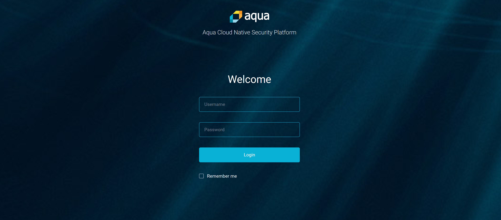

# Install Aqua on Kubernetes

Instructions to configure Aqua Security Tools on Azure Kubernetes Service (AKS) which can be used in Azure DevOps (AzDO) pipelines to scan containers during build operations in order to identify vulnerabilities. This document is concerned only with setting up the tools in AKS but details on setting up the AzDO pipelines can be found [here](./aqua.md).

## Prerequistes

- A running instance of Azure Kubernetes Services
- Azure CLI (latest version installed) or Cloudshell
- Aqua CSP License Token (provided by Aquasec)

Although there are several ways to install Aqua tools in your environmnet this document focuses getting setup in AKS as adapted from these [aquasec docs](https://docs.aquasec.com/docs/deploy-kubernetes). **Note:** that an aquasec login is required to access those docs.

## Get the credentials of the AKS cluster

In order to manage your cluster using the kubectl command line tools you will need to retrieve the relevant cluster's access credentials. Start up a console window and issue the commands below:

``` bash
az login
az aks get-credentials -n <YOUR CLUSTER NAME> -g <RESOURCE GROUP NAME>
```

## Create a security namespace

Setting up Aqua tools in K8s (including AKS) will require an "aqua-security" namespace that can be created by issuing the command below:

``` bash
kubectl create namespace aqua-security
```

## Prepare your AKS cluster for connecting to the Aqua Registry

### Create a secret for the aqua-regestry credentials

**Take note:** This secret is for the aqua registry and not your private registry.

Create a secret containing your aqua provided credentials using the command below. **Note** these are the same credentials you would use to log on at <https://my.aquasec.com>:

``` bash
kubectl create secret docker-registry aqua-registry --docker-server=registry.aquasec.com --docker-username=<Aquq Username>  --docker-password=<Aquq Password> --docker-email=no@email.com -n aqua-security
```

### Create a Service account

You will need a service account to allow your cluster to connect with the aqua registry. It can be created as follows:

``` yaml
kubectl create -n aqua-security -f - <<EOF
apiVersion: v1
kind: ServiceAccount
metadata:
  name: aqua
imagePullSecrets:
- name: aqua-registry
EOF

```

### Create a secret for AquaDB

The database backing your Aqua install requires a password. That password should be created as a secret via kubectl and container only alphanumeric characters to ensure compatability with Aqua.

``` bash
kubectl create secret generic aqua-db --from-literal=password=<DB_PASSWORD> -n aqua-security
```

### Create a YAML file

The aqua deployments consists of an Aqua Server, PostgreSQL Database, and Gateway Server. For convienience all of the bits can be installed by downloading or copying [this yaml](./aqua.yaml) and applying it to your AKS cluster. **Note:** when copying yaml ensure that the integrity of the yaml, including spacing, is maintained. Otherwise applying the file will fail. You may want to use a YAML validator like [this one](https://jsonformatter.org/yaml-validator) before applying copied yaml.

Once the YAML file is ready and validated go ahead and apply it as indicated below.

``` bash
kubectl create -f aqua-install.yaml -n aqua-security
```

## Configure the Aqua Security Dashboard

After deployment you can easily retreive the external address for the aqua-web container from kubectl.

``` bash
kubectl get service aqua-web -n aqua-security
NAME       TYPE           CLUSTER-IP   EXTERNAL-IP     PORT(S)                        AGE
aqua-web   LoadBalancer   10.0.94.99   xxx.xxx.xxx   443:30029/TCP,8080:30734/TCP   1m
```

## Wrapping Up

### First logon - Password Creation

The new installation is created with an "administrator" user that requires a password be create from the UI. Navigate to `http://<external IP for aqua-web>:8080` to create a password to log into the installation.

- username: "administrator"
- passwored: _any-8-alphanumeric-characters_



### Activate the new install

The final step before configuring your Aqua installation to work with AzDO is to activate the new install with the License Token provided by Aquasec. When you login to the console for the first time you will be presented with a page to enter the Token and begin using Aqua Security Tools in your project.


