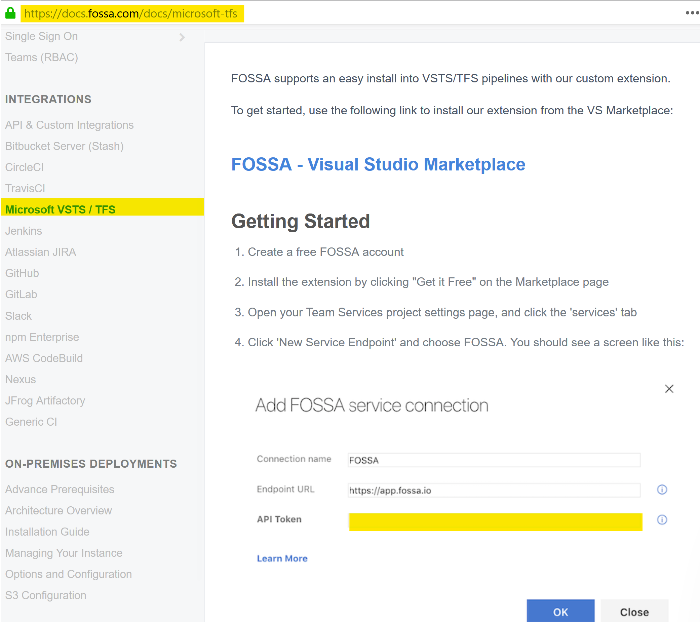
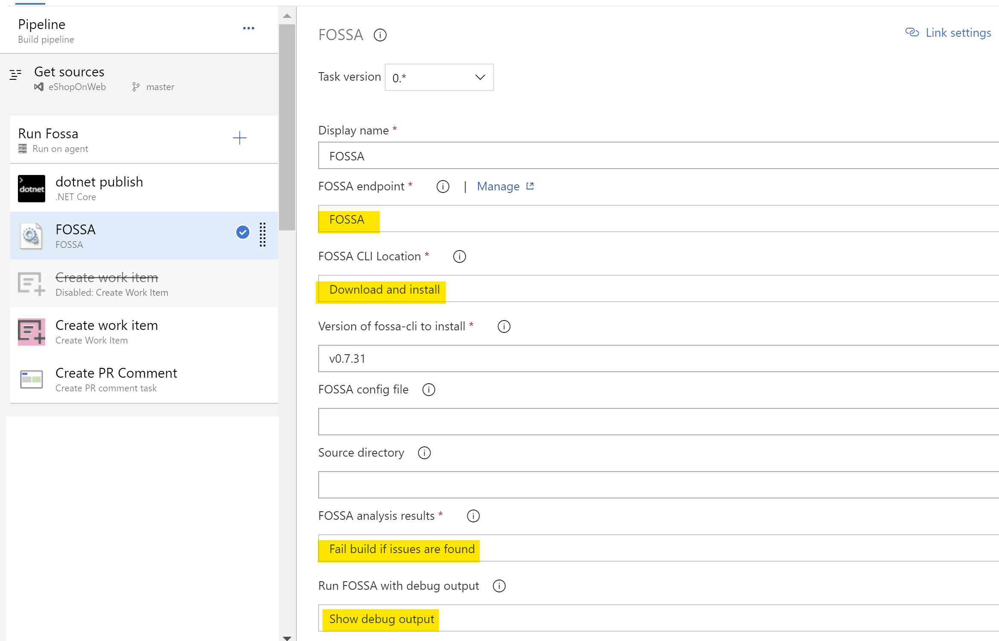

# FOSSA Security

It is relatively straight forward to create a trial account with FOSSA by visiting their [Website](https://fossa.com). This account will allow you to evaluate the services that Fossa Security provides on up to five applications before an official license is required.

Fossa provides realtime license and vulnerability management for open source dependencies and can integrate directly into your build pipeline.

## Installation and Configuration

You an find a set of instructions to install FOSSA in the sections below.

### Download and install Fossa cli

On Windows run:
  
``` Powershell
  @"%SystemRoot%\System32\WindowsPowerShell\v1.0\powershell.exe" -NoProfile -InputFormat None -ExecutionPolicy Bypass -Command "iex ((New-Object System.Net.WebClient).DownloadString('https://raw.githubusercontent.com/fossas/fossa-cli/master/install.ps1'))"
```

On Linux/Mac run:

``` bash
curl -H 'Cache-Control: no-cache' https://raw.githubusercontent.com/fossas/fossa-cli/master/install.sh | bash
```

### Configure your project for Fossa analysis

Switch to your code directory and run the following command to Run and Upload analysis

``` bash
fossa init
FOSSA_API_KEY=<Enter Your Key from the FOSSA Portal> fossa analyze
```

Once completed the results of the scan will be uploaded to the FOSSA portal and results can be analysed there.

### Configuring Fossa for use with Azure DevOps pipelines

Support information and Installation instructions can be found on Fossa's website. This [link](https://docs.fossa.com/docs/microsoft-tfs) will lead you to the relevant section of the docs.

1. Navigate to the [Visual Studio Marketplace](https://marketplace.visualstudio.com/items?itemName=Fossa.fossa-vsts) and download the Fossa Azure DevOps Extension and approve the installation for your organisation.
2. Create a Service Connection for Fossa. This requires the API Token for the previously created FOSSA account!

3. Configure the Fossa Azure DevOps Task in your pipeline

- Set the endpoint to "FOSSA"
- Set location as "Download and Install"
- FOSSA analysis results should be set to "Fail build if issues are found"
- Run FOSSA with debug output should have the value "Show debug output"

   
