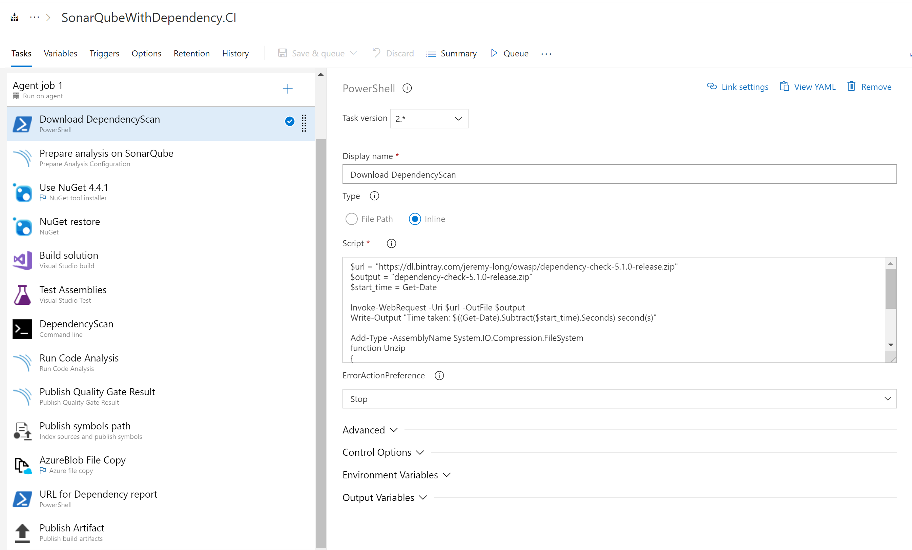
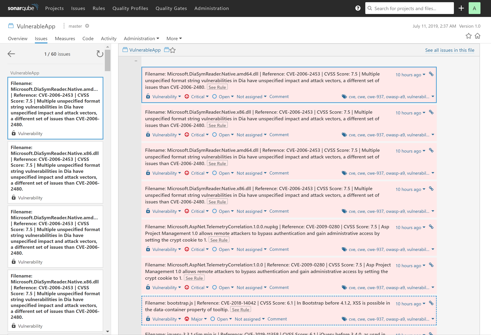
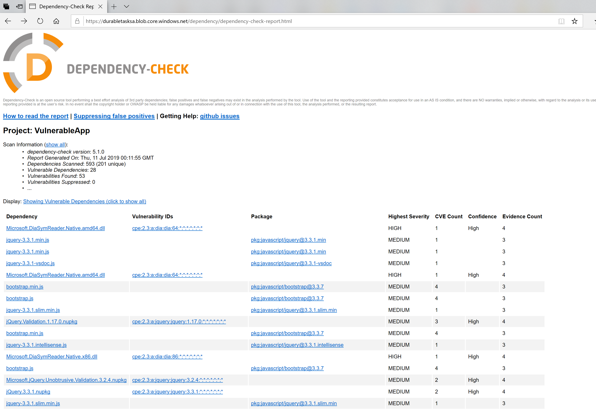

# OnPrem dependency scanning - SonarQube Dependency Scannning on Azure DevOps

## Setup Sonar Qube with Dependency

* [Dependency-Check Plugin for SonarQube](https://github.com/SonarSecurityCommunity/dependency-check-sonar-plugin)

I personally tried used Docker for creating enviornment for experiment. You need to change the plugin accoding to the version you use.For more detail, you can check [here](https://github.com/SonarSecurityCommunity/dependency-check-sonar-plugin).

``` powershell
 docker run -d -p 9000:9000 --name sonarqube sonarqube
 docker cp ./sonar-dependency-check-plugin-1.2.4.jar sonarqube:/opt/sonarqube/extensions/plugins sonar-dependency-check-plugin-1.2.4.jar
 docker restart sonarqube
```

You can login localshot:9000 on your local machine.

* [DockerHub - sonarqube](https://hub.docker.com/_/sonarqube)

Also I use ngrok to expose my local docker container to the Azure DevOps.

* [Ngrok](https://ngrok.com/)

## Configuring pipeline

This pipeline enable to use Dependency Scanning with pushing result to Sonar Qube. In addition, push the html report to a Azure Blob Storage.

I use Windows VS 2017 Hosted Agent for writing this document.  



This article explain the configuration of the key part. This document assume that you already know the configuration of the SonarQube.

### Download DependencyScan

Download the Dependency Check CLI by a task. I use PowerShell task.

* [Dependency Check CLI](https://jeremylong.github.io/DependencyCheck/dependency-check-cli/index.html)

You can put this code on the Script on PowerShell task. to download and unzip the CLI tool.

``` powershell
$url = "https://dl.bintray.com/jeremy-long/owasp/dependency-check-5.1.0-release.zip"
$output = "dependency-check-5.1.0-release.zip"
$start_time = Get-Date

Invoke-WebRequest -Uri $url -OutFile $output
Write-Output "Time taken: $((Get-Date).Subtract($start_time).Seconds) second(s)"

Add-Type -AssemblyName System.IO.Compression.FileSystem
function Unzip
{
    param([string]$zipfile, [string]$outpath)

    [System.IO.Compression.ZipFile]::ExtractToDirectory($zipfile, $outpath)
}

Unzip "dependency-check-5.1.0-release.zip" "$(System.DefaultWorkingDirectory)"

ls
```

### Prepare analysis on Sonar Qube

Advanced > Additional properties

You need to specify two variables to specify the place of reports.

``` powershell
sonar.dependencyCheck.reportPath=$(build.artifactstagingdirectory)/dependency-check-report.xml
sonar.dependencyCheck.htmlReportPath=$(build.artifactstagingdirectory)/dependency-check-report.html
```

for example, this is my configuration.

``` yaml
steps:
- task: SonarQubePrepare@4
  displayName: 'Prepare analysis on SonarQube'
  inputs:
    SonarQube: 'Sonar Ngrok'
    projectKey: VulnerableApp
    projectName: VulnerableApp
    extraProperties: |
     # Additional properties that will be passed to the scanner,
     # Put one key=value per line, example:
     # sonar.exclusions=**/*.bin
     sonar.dependencyCheck.reportPath=$(build.artifactstagingdirectory)/dependency-check-report.xml
     sonar.dependencyCheck.htmlReportPath=$(build.artifactstagingdirectory)/dependency-check-report.html
```

### Dependency Scan

This task scan the dependency.

I use command line task. Just before Sonar Qube Run Code Analysis.

``` powershell
cd dependency-check\bin
dependency-check.bat --project "VulnerableApp" --scan "$(System.DefaultWorkingDirectory)" -o "$(build.artifactstagingdirectory)" -f XML -f HTML
```

### AzureBlob File Copy

This task upload the HTML report to the Blob storage. Before moving to this Task, you need to create a Storage Account and container from the Azure portal.

* [Quickstart: Upload, download, and list blobs with the Azure portal](https://docs.microsoft.com/en-us/azure/storage/blobs/storage-quickstart-blobs-portal)

Currently, I use public blob, however, you can make it private and browse it with SAS token, if you want to protect the page.

This is the sample configuration of mine. You can select the Subscription, Storage, and Container name that you created it already.

``` yaml
steps:
- task: AzureFileCopy@2
  displayName: 'AzureBlob File Copy'
  inputs:
    SourcePath: '$(build.artifactstagingdirectory)'
    azureSubscription: 'Dev_Ops_TED_tsushi'
    Destination: AzureBlob
    storage: durabletasksa
    ContainerName: dependency
    outputStorageUri: dependencyScanResult
    outputStorageContainerSasToken: dependencyScanResultSASToken
```

## Sharing URL

Finally, I expose the URL which developers can access the Report with PowerShell Task.

``` powershell
Write-Host "See dependency report https://durabletasksa.blob.core.windows.net/dependency/dependency-check-report.html"
```

I didn't test it, however, if you use private container, you can write something like this.

``` powershell
Write-Host "See dependency report $(dependency)?$(dependencyScanResultSASToken)"
```

## CI

Once execute this CI, you can see the result on SonerQube portal, and HTML report on the Azure Blob Storage.

_Report on SonarQube Portal_


_Report on Blob storage_


## Conclusion

You can publish the report with scanning. If you create a custom task, you might publish the result to the pipeline result page.
