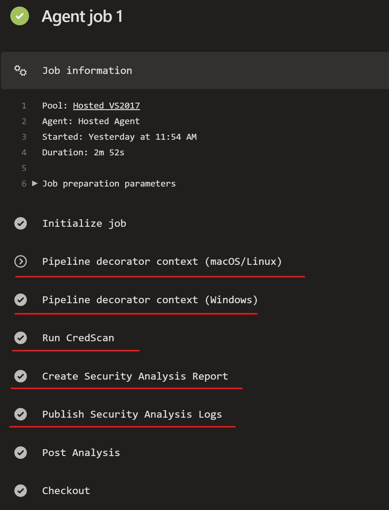

# Injecting Policy using Azure DevOps Pipeline Decorators

## What are Pipeline Decorators

Pipeline decorators allow you to add steps to the beginning, just after checkout, or end of every job. Nothing prevents you from using all three in an organization or project. This is different than adding steps to a single definition because it applies to all pipelines in an organization.

A good example of such a task would be running a malware detector on every pipeline to make sure that dependencies do not contain vulnerabilities or scanning for credentials in code to insure that those secrets do not make their way into the wrong hands. For the extra time that these task add to pipeline execution they prove to be well worth it.

## When to run decorators

Decorators can be run either before or after a regular pipeline, or just after a code checkout has completed. The contributions section of the vss-extension.json file needs to contain the following for pre-processing:

```json
"targets": [
                "ms.azure-pipelines-agent-job.pre-job-tasks"
            ]
```

after a pipeline runs a code checkout

``` json
"targets": [
                "ms.azure-pipeliens-agent-job.post-checkout-tasks"
            ]
```

and conversely for post-processing:

```json
"targets": [
                "ms.azure-pipelines-agent-job.post-job-tasks"
            ]
```

## Pipeline Decorator Conditional Execution

Designers or developers of Pipeline decorators may find that there are exceptional circumstances in which the decorator needs to be targeted at a select branch, project or be disabled altogether provisionally during execution. In this case, a filter condition may need to be applied to facilitate this change.

Pipeline decorators can be filtered using [pipeline decorator expression context](https://docs.microsoft.com/en-us/azure/devops/extend/develop/pipeline-decorator-context?view=azure-devops) and individual tasks in the decorator can also be [conditionally](https://docs.microsoft.com/en-us/azure/devops/pipelines/process/conditions?view=azure-devops&tabs=yaml) run based on criteria passed into the yaml using [yaml expression syntax](https://docs.microsoft.com/en-us/azure/devops/pipelines/process/expressions?view=azure-devops#functions).

## Creating and Publishing Extensions

Developing and publishing Azure DevOps extensions is well documented on the official docs channel.

For information about [creating and publishing Azure DevOps extensions](https://docs.microsoft.com/en-us/azure/devops/extend/develop/add-build-task?toc=%2Fazure%2Fdevops%2Fextend%2Ftoc.json&bc=%2Fazure%2Fdevops%2Fextend%2Fbreadcrumb%2Ftoc.json&view=azure-devops) and  creating a [pipeline decorator](https://docs.microsoft.com/en-us/azure/devops/extend/develop/add-pipeline-decorator?view=azure-devops) follow the aforementioned hyperlinks.

**An example that demonstrates how to inject a credential scanning and reporting into each pipeline can be found in the [CSE DevSecOps Repo](https://dev.azure.com/csedevops/DevSecOps/_git/SecOps_PipelineDecorator)**

## Installation

 To [install](https://docs.microsoft.com/en-us/azure/devops/marketplace/install-extension?view=azure-devops) an Azure DevOps Extension to your Azure DevOps Organisation. **You will need to be an organization admin or you may have to request the assistance of one.**

## Output of the Pipeline Decorator


