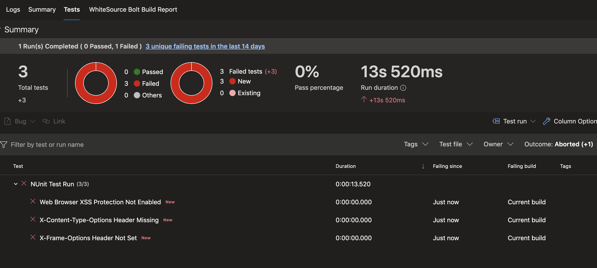

# Directly Coded YAML Pipeline

> There are various tools used in preparation and execution of pen-testing application. Following details discuss simple addition of pen-testing to Azure DevOps through a yml pipeline directly. 

##  OWASP Zed Attack Prozy (ZAP)


- Additional Steps may be required for [self-hosted agents](./Self_Hosted.md). 

**Create a Pipeline on a Linux Agent Pool** 

``` YAML
pool:
  vmImage: 'ubuntu-16.04'

```

**Install Docker on the Agent**

``` YAML

steps:
- checkout: none
- task: DockerInstaller@0
  inputs:
    dockerVersion:  '17.09.0-ce'

```

_If the scan is to be executed against a **containerized application** add something similar to the following (with your port and image details) so the container is running in the background on your agent during the scan:_

``` YAML

docker run -d -p 3000:3000 myrepo/myimage:tag 

```
_Prep the agent to work-around forced use of \r\n in Azure DevOps scripts and add the directory structure needed for the -volume we will create to export the scan results from the container._

```YAML
- script: |
    #!/bin/bash
    if [ $# -eq 0 ]; then echo "Rewriting self." ; sudo apt install -yq dos2unix > /dev/null 2>&1 ; dos2unix -q "${BASH_SOURCE[0]}" > /dev/null 2>&1 ; chmod a+x "${BASH_SOURCE[0]}" ; exec "${BASH_SOURCE[0]}" --no-rewrite ; else echo "Hot patching successful." ; fi ;
   
   mkdir /tmp/owaspzap && chmod 777 /tmp/owaspzap
```
_**Next:** add the following to our script in to pull down the latest stable OWASP/ZAP container and perform the scan repacing << scan-target >> with the appropriate entry for your target._

**Scan targets:**
- Application running on localhost/docker: 

    << scan-target >> = "http://$(ip addr show eth0 | grep 'inet ' | awk '{print $2}' | cut -f1 -d'/'):your-apps-port-number"

- VM created for test-deployment in situation where application to test is not containerized and needs to run in a different environment than provided by this test agent. This would act as a CD stage-gate type componant because of the nature of non-containerized applications. **NOTE:** In this case you should have taken additional steps for [self-hosted agents](./Self_Hosted.md) mentioned earlier to make sure that your agent has access to scan within your testing VNET.  

    << scan-target >> = "https://ip-address-for-vm:appropriate-port"

``` YAML

    docker run -v /tmp/owaspzap:/zap/wrk/:rw -t owasp/zap2docker-stable zap-baseline.py -t << scan-target >> -J report.json -r report.html
```
_Next, define the failing threshold for the scan if one has not already been defined as an environmnet variable. This threshold defines the score at which scans will fail your build. **Note:** This threshold can optionally be set as an environment variable [FAIL_THRESHOLD=value]. 

``` YAML
    # Check if the environment variable "FAIL_THRESHOLD" is set; if not, set it
    THRESHOLD=${FAIL_THRESHOLD}
    if [ -z "$THRESHOLD" ] ; then
            THRESHOLD=50
    fi
```
_The scoring factors for the scan can be retrieved from the scan reports that we dumped to report.json in our docker attached volume during the scan. We can use them to generate the score for this scan session. 

**IMPORTANT:** These scores are not a measure of application security. Instead they offer a point to engage the Security and Engineering Teams in discussion around continued improvment of the application's security. 

``` YAML

    # Retrieve risk codes, confidences, and counts from the JSON report using the 'jq' tool
    RISK_CODES=($(jq '.site[0].alerts[].riskcode | tonumber' < /tmp/owaspzap/report.json))
    CONFIDENCES=($(jq '.site[0].alerts[].confidence | tonumber' < /tmp/owaspzap/report.json))
    COUNTS=($(jq '.site[0].alerts[].count | tonumber' < /tmp/owaspzap/report.json))

    # Calculate the points incurred by each issue
    POINTS=0
    for ((i=0;i<${#RISK_CODES[@]};++i)); do
        RISK_CODE=${RISK_CODES[$i]}
        CONFIDENCE=${CONFIDENCES[$i]}
        COUNT=${COUNTS[$i]}
        SCORE=$((RISK_CODE * CONFIDENCE * COUNT))
        POINTS=$((POINTS + SCORE))
    done
```
**Did we pass the scan?**

- Finish up the scanning script by setting the script name and setting the threshold if we don't want to use the fallback score defined above.
- Make sure that this script is set to continue on error so that we can get better reports and persist our artifacts.

``` YAML
    if [ $POINTS -ge $THRESHOLD ] ; then
        echo "Failed - $POINTS (above threshold of $THRESHOLD)" 1>&2
        exit 1
    else
        echo "Success - $POINTS (below threshold of $THRESHOLD)"
        exit 0
    fi
  displayName: Run OWASP ZAP Full Scan
  env:
    FAIL_THRESHOLD: 100
  continueOnError: true
```

> **Important** _all of the remaining steps include 'condition: always()'. This makes sure that if the build fails we still get a useful report. Otherwise, our scan results will not be presented in a useful manner when a threshold is surpassed._ 

Copy the build artifacts (tests results) to the Artifact Directory

``` YAML

- task: CopyFiles@2
  condition: always()
  inputs:
    SourceFolder: '/tmp/owaspzap/'
    TargetFolder: '$(Build.ArtifactStagingDirectory)'
```
Publish the reports so they are available in the pipeline build page.

``` YAML

- task: PublishBuildArtifacts@1
  condition: always()
  inputs:
    ArtifactName: 'owasp_zap_reports'
```

Install handlebars to take advantage of the templating for a simple reporting dashboard/tab and generate the template to report from. 

``` YAML

- bash: |   
   sudo npm install -g handlebars-cmd
   
   cat <<EOF > /tmp/owaspzap/nunit-template.hbs
   {{#each site}}
   
   <test-run
       id="2" 
       name="Owasp test" 
       start-time="{{../[@generated]}}"  >
       <test-suite 
           id="{{@index}}"
           type="Assembly" 
           name="{{[@name]}}" 
           result="Failed" 
           failed="{{alerts.length}}">
           <attachments>
               <attachment>
                   <filePath>/tmp/owaspzap/report.html</filePath>
               </attachment>
           </attachments>
       {{#each alerts}}<test-case 
           id="{{@index}}"
           name="{{alert}}"  
           result="Failed" 
           fullname="{{alert}}"
           time="1">
               <failure>
                   <message>
                       <![CDATA[{{{desc}}}]]>
                   </message>
                   <stack-trace>
                       <![CDATA[
   Solution:
   {{{solution}}}
   
   Reference:
   {{{reference}}}
                       
   instances:{{#each instances}}
   * {{uri}}
       - {{method}}
       {{#if evidence}}- {{{evidence}}}{{/if}}
                       {{/each}}]]>
                   </stack-trace>
               </failure>
       </test-case>
       {{/each}}
       </test-suite>
   </test-run>
   {{/each}}
   EOF
  displayName: 'owasp nunit template'
  condition: always()

```

Use the handlebars template and json report from the ZAP scan to generate an xml report in the nunit style to display. 

``` YAML

- bash: ' handlebars /tmp/owaspzap/report.json < /tmp/owaspzap/nunit-template.hbs > /tmp/owaspzap/test-results.xml'
  displayName: 'generate nunit type file'
  condition: always()

```

**Publish the NUnit Style report**

``` YAML

- task: PublishTestResults@2
  displayName: 'Publish Test Results **/TEST-*.xml'
  inputs:
    testResultsFormat: NUnit
    testResultsFiles: '/tmp/owaspzap/test-results.xml'
  condition: always()

```

**_View_** your lovely report.

