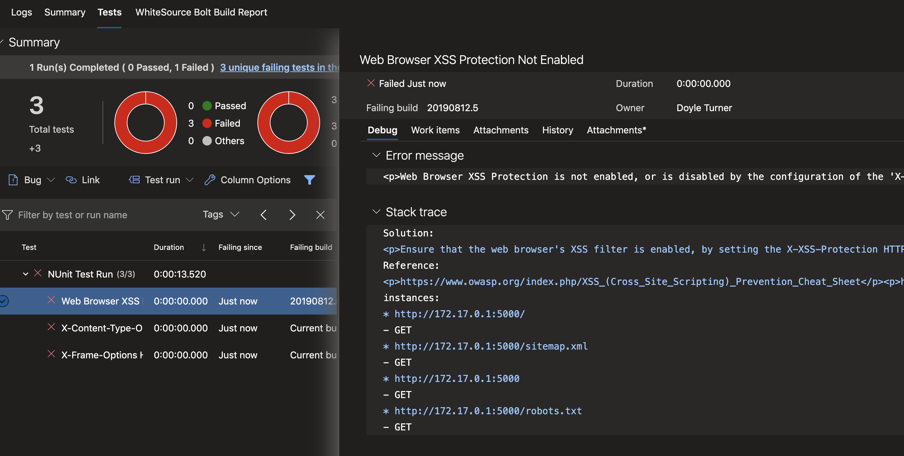

# YAML Based Azure Pipeline w/ Zap-scanner Extension

> There are various tools used in preparation and execution of pen-testing application. Following details discuss simple addition of pen-testing to Azure DevOps through a yml pipeline directly.

## OWASP ZAP-Scanner Extension

- Additional Steps may be required for [self-hosted agents](./Self_Hosted.md).
- Requires installation of the [OWASP/Zap-Scanner Extension](https://marketplace.visualstudio.com/items?itemName=CSE-DevSecOps.zap-scanner)

- _Currently a private extension - Must be shared directly from the **CSE-DevOps Team**._

- Once the extension has been shared with your Azure DevOps Organization you can install it from the Shared

### Create a Pipeline on a Linux Agent Pool

```YAML
pool:
  vmImage: 'ubuntu-16.04'
```

### Install Docker on the Agent

```YAML
steps:
- checkout: none
- task: DockerInstaller@0
  inputs:
    dockerVersion:  '17.09.0-ce'
```

_If the scan is to be executed against a **containerized applicaition** add something similar to the following (with your port and image details) so the container is running in the background on your agent during the scan:_

**Note:** In the case of a normal CI build this may be a good spot to build the image so that it can be tested before adding it to an image repo.

```YAML
## steps to build the docker image have been ommited...

- bash: 'docker run -d -p 5000:5000 training/webapp'
  displayName: 'Run app in docker container'
```

Add in the step to run the OWASP/ZAP Scanner.

> This example is running a baseline scan (Top 10, around 1 min of passive scanning) against a web app on port 5000. The scan has a threshold of 50 and any scan score above that will result in a failure of the build pipeline.

```YAML
- task: owaspzap@0
  displayName: 'ZAP Scanner'
  inputs:
    agressivemode: false
    scantype: 'agentScan'
    threshold: 50
    provideCustomContext: false
    port: 5000
```

> **Important** _all of the remaining steps include 'condition: always()'. This makes sure that if the build fails we still get a useful report. Otherwise, our scan results will not be presented in a useful manner when a threshold is surpassed._

We need to copy the output from the can for publishing.

``` YAML
- task: CopyFiles@2
  condition: always()
  inputs:
    SourceFolder: 'owaspzap/'
    TargetFolder: '$(Build.ArtifactStagingDirectory)'
```

Publish the reports so they are availble in the pipeline build page.

```YAML
- task: PublishBuildArtifacts@1
  condition: always()
  inputs:
    ArtifactName: 'owasp_zap_reports'
```

Install handlebars to take advantage of the templating for a simple reporting dashboard/tab and generate the template to report from.

```YAML
- bash: |
   sudo npm install -g handlebars-cmd

   cat <<EOF > owaspzap/nunit-template.hbs
   {{#each site}}

   <test-run
       id="2"
       name="Owasp test"
       start-time="{{../[@generated]}}"  >
       <test-suite
           id="{{@index}}"
           type="Assembly"
           name="{{[@name]}}"
           result="Failed"
           failed="{{alerts.length}}">
           <attachments>
               <attachment>
                   <filePath>owaspzap/report.html</filePath>
               </attachment>
           </attachments>
       {{#each alerts}}<test-case
           id="{{@index}}"
           name="{{alert}}"
           result="Failed"
           fullname="{{alert}}"
           time="1">
               <failure>
                   <message>
                       <![CDATA[{{{desc}}}]]>
                   </message>
                   <stack-trace>
                       <![CDATA[
   Solution:
   {{{solution}}}

   Reference:
   {{{reference}}}

   instances:{{#each instances}}
   * {{uri}}
       - {{method}}
       {{#if evidence}}- {{{evidence}}}{{/if}}
                       {{/each}}]]>
                   </stack-trace>
               </failure>
       </test-case>
       {{/each}}
       </test-suite>
   </test-run>
   {{/each}}
   EOF
  displayName: 'owasp nunit template'
  condition: always()
```

Use the handlebars template and json report from the ZAP scan to generate an xml report in the nunit style to display.

```YAML
- bash: ' handlebars owaspzap/report.json < owaspzap/nunit-template.hbs > owaspzap/test-results.xml'
  displayName: 'generate nunit type file'
  condition: always()
```

### Publish the NUnit Style report

```YAML
- task: PublishTestResults@2
  displayName: 'Publish Test Results **/TEST-*.xml'
  inputs:
    testResultsFormat: NUnit
    testResultsFiles: 'owaspzap/test-results.xml'
  condition: always()
```

You should now have 'test' tab on the pipeline build that displays useful infomration about vulnerabilities revealed during the scan. The vulnerability test results are not reliant on the pass/fail outcome of the build. This means that even with a scan that is acceptable by the threshold you could have some areas of concern to explore in the repot.


The list of failures (currently under "NUnit Test Run) are expandable links. Clicking on each will open details to the right which can guide the team to fixing the issues found.


