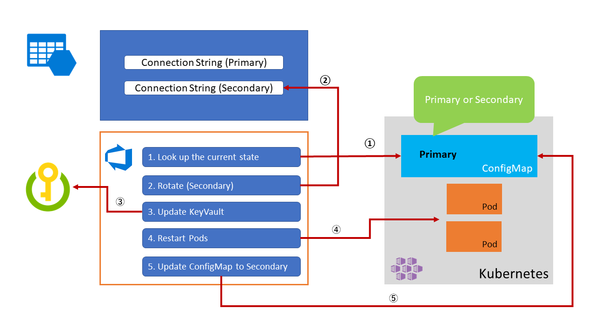
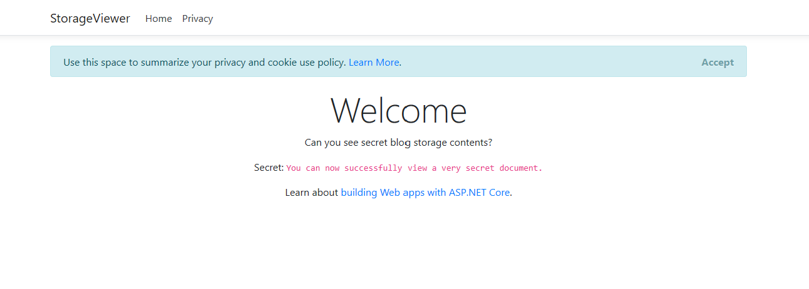

# Azure Kubernetes Service Secret Rotation with Blue Green Rotation

In this article you will learn to rotate Azure Key Vault secrets used to securely store Azure storage account connection strings without incurring downtime.

We introduced Secret Rotation with [Automatic secret rotation with Azure Key Vault](./KV_secret_rotation.md) using Azure Automation. However, for an AKS scenario, Azure DevOps might be the best option to execute shell commands since Azure Automation doesn't support the `kubectl` command. We use [Azure CLI](https://docs.microsoft.com/en-us/cli/azure/install-azure-cli?view=azure-cli-latest) to create the bash script, because it works well with the `kubectl` command.

## Overview

Blue Green Secret rotation idea is to rotate secrets without downtime. For example, Storage accounts have two connection strings. Instead of rotating both of them simultaneously, we can rotate it one by one and update the secrets on Kubernetes.



## Create a ConfigMap

Use the following configmap to determine which connection is used. You can find it in [here](https://dev.azure.com/csedevops/DevSecOps/_git/SecretRotation?path=%2FconfigMap.yml&version=GBmaster).

Example _configMap.yml_

```Yaml
apiVersion: v1
kind: ConfigMap
metadata:
  name: current-storage-key
  namespace: default
data:
  CurrentAccountKeyId: primary
```

## Create Azure DevOps pipeline

  Create Azure DevOps pipeline with Linux Based Agent that includes the following steps.

  1. Get current connection string from ConfigMap

  2. ReGenerate the new connection string

  3. Update Key Vault secret with the new connection string

  4. Update ConfigMap

  5. Restart Pods

Storage Account

`kubectl rollout restart {deployment name}` will restart the pods one by one. `kubectl rollout status {deployment name}` will wait until the rollout is finished.

NOTE: To execute this pipeline, a service prinicpal is required with  execute permission to set KeyVault secrets. To double check if the service principal can access the target KeyVault See KeyVault > Access Policies on your portal.

You can see the full configuration of this pipeline [here](https://dev.azure.com/csedevops/DevSecOps/_apps/hub/ms.vss-build-web.ci-designer-hub?pipelineId=132&branch=master).

Example _azure_pipeline.yml_

``` yaml
trigger:
- none

pool:
  vvmImage: 'ubuntu-latest'

variables:
  Namespace: 'default'
  StorageAccount: 'YOURSTORAGEACCOUNTNAME'
  ResourceGroup: 'YOURRESOURCeGROUPNAME'
  ConnectionStringKeyVaultSecret: 'storageConnectionString'
  KeyVaultName: 'YOURKEYVAULTNAME'
  ConfigMapName: 'current-storage-key'
  SubscriptionServiceEndpoint: 'YOURAZURESUBSCRIPTION'
  KubernetesName: 'YOURKUBERNETESSERVICENAME'
  KubernetesServiceConnection: 'YOURKUBERNETESSERVICECONNECTIONNAME'
  KubernetesDeployment: 'deployment/storage-viewer-deployment'

steps:
- task: KubectlInstaller@0
  displayName: 'Install Kubectl latest'
- task: AzureCLI@1
  displayName: 'Rotate a storage key and upload to KeyVault'
  inputs:
    azureSubscription: '$(SubscriptionServiceEndpoint)'
    scriptLocation: inlineScript
    inlineScript: |

     # download the kubernetes secrets
     az aks get-credentials --name $(KubernetesName) --resource-group $(ResourceGroup)

     currentKeyId=$(kubectl get configmap $(ConfigMapName) -n $(Namespace) -o json | jq '.data.CurrentAccountKeyId' | sed s/\"//g)

     keyName="secondary"
     if [ "$currentKeyId" == "secondary" ]; then
         echo "regenerating primary key"
         keyName="primary"
     else
        echo "regenerating secondary key"
     fi

     # regen the key
     az storage account keys renew --account-name $(StorageAccount) --key $keyName -g $(ResourceGroup)

     # update the secret in key vault
     echo "updating the secret in keyvault"

     # show connection string
     connectionString=$(az storage account show-connection-string -n $(StorageAccount) -g $(ResourceGroup) --key $keyName | jq '.connectionString')

     # update the key vault
     az keyvault secret set -n $(ConnectionStringKeyVaultSecret) --value $connectionString --vault-name $(KeyVaultName)

     echo "Setting the pipeline variable with $keyName"

     echo "##vso[task.setvariable variable=NewStorageAccountKeyName;]$keyName"
- bash: |
    echo "Keyname is $(NewStorageAccountKeyName)"

    cat <<EOF > configmap.yml
    apiVersion: v1
    kind: ConfigMap
    metadata:
      name: $(ConfigMapName)
      namespace: $(Namespace)
    data:
      CurrentAccountKeyId: $(NewStorageAccountKeyName)
    EOF

    cat configmap.yml
  displayName: Create configMap yaml file
- task: Kubernetes@1
  displayName: "kubectl create configmap"
  inputs:
    namespace: $(Namespace)
    kubernetesServiceEndpoint: $(KubernetesServiceConnection)
    command: apply
    arguments: -f configmap.yml --record
- task: Kubernetes@1
  displayName: 'kubectl rollout restart'
  inputs:
    kubernetesServiceEndpoint: $(KubernetesServiceConnection)
    namespace: $(Namespace)
    command: rollout
    arguments: 'restart $(KubernetesDeployment)'
- task: Kubernetes@1
  displayName: 'kubectl rollout status'
  inputs:
    kubernetesServiceEndpoint: $(KubernetesServiceConnection)
    namespace: $(Namespace)
    command: rollout
    arguments: 'status $(KubernetesDeployment)'
    checkLatest: true
```

## Deploy application

To test the pipeline, deploy a sample application. The application fetches contents from blob storage. To run this application, you need the following.

* A Service Principal that can fetch data from Key Vault.
* A Storage Account with a text file (verysecret.txt) in a container (container).
* Build and Deploy the application to a Kubernetes Cluster

The source code for a [sample application built on ASP.Net (.Net core)](https://dev.azure.com/csedevops/DevSecOps/_git/StorageViewer?path=%2F&version=GBmaster) is available as well a [pipeline to build & push the application to an ACR](https://dev.azure.com/csedevops/DevSecOps/_build?definitionId=131&_a=summary) named "StorageViewer.CI." The application references an expected "container/verysecret.txt" file on your blob with a secret on the KeyVault using [KeyVault Flex Volume](https://github.com/Azure/kubernetes-keyvault-flexvol).

## Create Secret

Create a service principal to access KeyVault from the sample app and set it to the secret.

``` bash
az ad sp create-rbac --name ServicePrinipalForApp

kubectl create secret generic kvcreds --from-literal clientid=<CLIENTID> --from-literal clientsecret=<CLIENTSECRET> --type=azure/kv
```

## Set Policy to the KeyVault

Add policy to the KeyVault.

``` bash
az role assignment create --role Reader --assignee <principalid> --scope /subscriptions/<subscriptionid>/resourcegroups/<resourcegroup>/providers/Microsoft.KeyVault/vaults/<keyvaultname>

az keyvault set-policy -n $KV_NAME --key-permissions get --spn <YOUR SPN CLIENT ID>
az keyvault set-policy -n $KV_NAME --secret-permissions get --spn <YOUR SPN CLIENT ID>
az keyvault set-policy -n $KV_NAME --certificate-permissions get --spn <YOUR SPN CLIENT ID>
```

## Apply

After publishing the sample app's image, you can deploy it to a k8s cluster. with [this yaml file](https://dev.azure.com/csedevops/DevSecOps/_git/StorageViewer?path=%2Fstorage-viewer.yml&version=GBmaster). Change the `options` part according to your enviornment.

Example _storage-viewer.yml_

```Yaml
apiVersion: apps/v1
kind: Deployment
metadata:
  name: storage-viewer-deployment
  labels:
    app: storage-viewer
spec:
  replicas: 3
  selector:
    matchLabels:
      app: storage-viewer
  template:
    metadata:
      labels:
        app: storage-viewer
    spec:
      containers:
      - name: storage-viewer-flex-kv
        image: oht39abj0acr.azurecr.io/storageviewer:latest
        volumeMounts:
        - name: test
          mountPath: /kvmnt
          readOnly: true
      volumes:
      - name: test
        flexVolume:
          driver: "azure/kv"
          secretRef:
            name: kvcreds                             # [OPTIONAL] not required if using Pod Identity
          options:
            usepodidentity: "false"                   # [OPTIONAL] if not provided, will default to "false"
            keyvaultname: "oht39abj0kv"              # [REQUIRED] the name of the KeyVault
            keyvaultobjectnames: "storageConnectionString"         # [REQUIRED] list of KeyVault object names (semi-colon separated)
            keyvaultobjectaliases: "storageConnectionString"      # [OPTIONAL] list of KeyVault object aliases
            keyvaultobjecttypes: secret               # [REQUIRED] list of KeyVault object types: secret, key, cert
            resourcegroup: "oht39abj0rg"        # [REQUIRED] the resource group of the KeyVault
            subscriptionid: "YOUR_SUBSCRIPTION_ID"                 # [REQUIRED] the subscription ID of the KeyVault
            tenantid: "YOUR_TENANT_ID"                    # [REQUIRED] the tenant ID of the KeyVault
```

## Varify deployment

``` bash
kubectl get pods

NAME                                          READY   STATUS    RESTARTS   AGE
         151d
storage-viewer-deployment-6d9b9495fd-9pz95    1/1     Running   0          45m
storage-viewer-deployment-6d9b9495fd-gpph4    1/1     Running   0          45m
storage-viewer-deployment-6d9b9495fd-sl7xz    1/1     Running   0          159d
```

You will find that the pod is deployed to the cluster.

``` bash
 kubectl port-forward pod/storage-viewer-deployment-6d9b9495fd-9pz9 8090:80
 ```

You can see the web page to access `http://localhost:8090`



The 'verysecret.txt file was downloaded from blob storage and displays the contents after the `Secret:`. If it is successfully displayed, your secret (storageAccount connection string) is fetched correctly.
