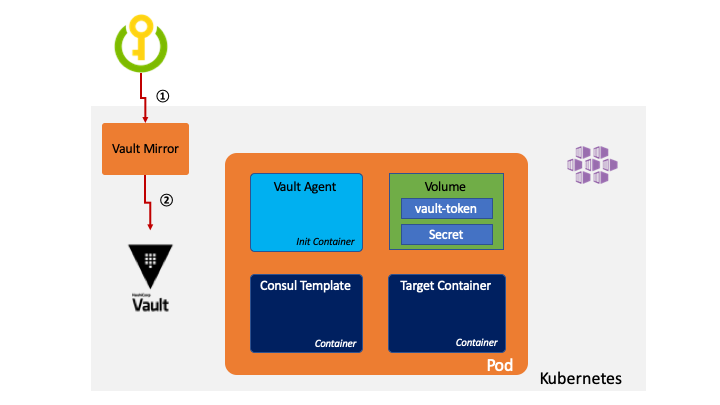

# Kubernetes Rotation Strategies for secrets used in pod deployments

Secret rotation provides a way to automate the process of reflecting secret changes to your applications. However, an additional technique is needed to reflect the change to your pod deployments on kubernetes.  This topic provide an overview and three strategies to implement update to pod level secrets.

## Key Vault FlexVolume with Restarting

[Key Vault FlexVolume](https://github.com/Azure/kubernetes-keyvault-flexvol) provides an integration for Azure Key Vault with Kubernetes. Secrets, keys, and certificates in a key management system become volume accessible to pods.  However, once it is mounted, the secret will **not** reflect the change from Key Vault. In order for the update in KeyVault to take affect, the pod needs to be restarted.


## Instructions for setting up the Key Vault FlexVolume

Follow the instructions [here](https://github.com/Azure/kubernetes-keyvault-flexvol).

## Azure DevOps Secret Rotation with Pod Restart

[Azure DevOps](https://azure.microsoft.com/en-us/services/devops/) provides a feature [Scheduled Trigger](https://docs.microsoft.com/en-us/azure/devops/pipelines/build/triggers?view=azure-devops&tabs=yaml#scheduled-triggers) that can be used to automate pod secret rotation with restart.  Teams can leverage this feature to schedule regular execution of [Key Vault Secret Rotation](KV_secret_rotation.md) script on the Azure DevOps as a Pipeline. Once the rotation is finished, execute the pod restart command below.  For example, If you have a deployment, you can restart the pod, one by one using this command. You restart all pods on the `nginx-deployment` deployment.

```BASH
 kubectl rollout restart deployment/nginx-deployment
```

After restarting the pods, the updated secret will be reflected in your pod.


## Notifications for Azure Key Vault (Preview)

Azure Key Vault has a preview feature [Notifications for Azure Key Vault](https://keyvaultdocs.azurewebsites.net/KeyVault/Notifications/OnBoarding.html). It is designed to allow users to be notified when the status of a secret stored in key vault has changed.
Currently, the link is available for MSFT internal only. You need to submit a request to use this preview feature.

Once the secret has been changed, you can get the notification through the EventGrid. Then you can restart the pod with Azure Functions for example.  We will add an example of this pattern in future once the featue is GA.


## HashiCrop Vault Secret Rotation

HashiCorp provides their [Vault](https://www.vaultproject.io) product for secrets management that works with Azure. The [Consul Template](https://learn.hashicorp.com/consul/developer-configuration/consul-template) can be configured to watch the for EoL of a secret of Vault,
dinamically update the secret with automatic vault token renewal and caching with [Vault Agent](https://www.vaultproject.io/docs/agent/). You can deploy Vault with [helm chart](https://www.hashicorp.com/blog/announcing-the-vault-helm-chart).  Also, you can learn how to setup Vault Secret Rotation with
AKS in [Vault Agent with Kubernetes](https://learn.hashicorp.com/vault/identity-access-management/vault-agent-k8s#azure-kubernetes-service-cluster).

See the diagram below which shows the sequence for secret rotation using Vault.


1. Vault Agent fetches the token from Vault
2. Vault Agent generates a vault-token on the Volume
3. Consul Template fetches secrets using vault-token
4. Consul Template generates secret on the Volume

Once configured, the Target Container can use the secret by mounting the Volume. Since the Consul Template uses a daemon, if the secret reaches TTL expiry, it attempt to periodically fetch
the new Secret from the Vault.

You can manually update the secret, and set a ttl, using the vault command. It will set the secret and expire in 30 sec. After the 30 sec, if you update the secret using same command with changing secret,
you will find the secret on the pod is updated after 30 sec.

``` bash
vault kv put secret/myapp/config username='appuser' password='suP4rsec(et!' ttl='30s'
```

For more details on deploy HashiCorp Vault with AKS integration, see the following post

* [Secret Rotation with HashiCorp Vault on AKS](https://medium.com/@tsuyoshiushio/secret-rotation-with-hashicorp-vault-on-aks-f7dd9b32371b)

## Vault Mirror

HashiCorp Vault provide dynamic secret rotation feature. If you want to use Key Vault, We can create the same tools like Vault Agent and Consul Template.
However, the easiest way for using Key Vault might be developing a small daemon called `Vault Mirror`. It watches the Key Vault once change happens, it mirrors the secret on HashiCorp Vault.
We may be developing a sample implementation of Vault Mirror in the near future. It will use polling model or Key Vault notification feature.  If your customer is looking to implement this scenario we would be happy to work with you and the partner.



## How to choose your strategy

This article introduces four strategies. 

Flex Volume solution requires Pod restarting:

* `Flex Volume with Rotation` strategy, in your secret rotation script, you need to include restart command. It might required REST API call or Client Library of Kubernetes.
* `Flex Volume with Key Vault Notification` strategy enable to restart it by Webhook of Key Vault which the secret changes.
* `HashiCorp Vault` strategy provide a dynamic rotation and very good tools when customer want onPrem solution.
* `Vault Mirror` strategy is good when you want to centerize the secret on Key Vault however,
want to use HashiCorp vault tools on Kubernetes.

### Secret Rotation Solution on Kubernetes

| | Flex Volume with Rotation | Flex Volume with KeyVault notication | Hashicorp Vault | Vault Mirror |
| ---------- | :------------------: |:-------------------------: | :--------------------------: | --------------: |
| Sync with Pods | Restart Pods in a Rotation Script | Automated | Automated | Automated |
| Dynamic Rotation (Pod Restart not Required) | X | X | O | O |
| On Prem only | | | O | O |
| KeyVault | O | O | | O |
| Required | Keyvault, Azure, DevOps | KeyVault, Automation, Azure Functions | Vault, Consul Template | Keyvault, Mirror, Vault, Consult Template |
