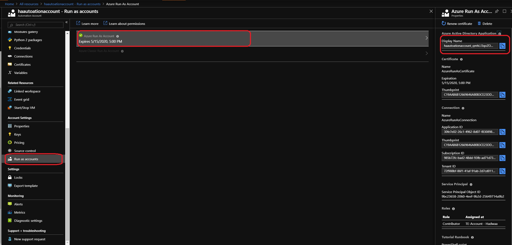
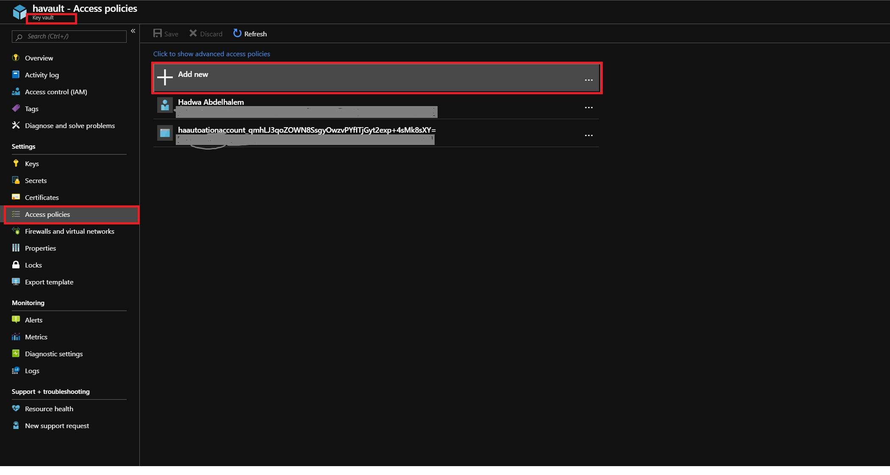

# Automating secret rotation wth Azure Keyvault

Using Azure automation Run books, and the Azure powershell framework you can create automated tasks that run on schedule to update a resources secrets/keys and store the updated values in key vault.

## General Azure resources secrets setup

- [Create an Azure Automation Account using the azure portal](https://docs.microsoft.com/en-us/azure/automation/automation-quickstart-create-account)

- [Create or use you existing Azure Key Vault instance](https://docs.microsoft.com/en-us/azure/key-vault/quick-create-portal)

- Grant Azure Automation Account an access to the Azure Key Vault

  - Copy the Azure Active Directory Application and Service Principle generated by Azure Automation from the Automation account "Run as account" blade.

    

  - Go to "Access Policies" section in your Azure Key Vault account, Click on the Add Button and In the Add Access Policy blade click on the Select Principle button and paste in the Name of the Azure AD application name for the Automation Account. Select the application from the list. And Click on Select button. Give Permission to Get, List and Set secrets. Click on Ok and Save buttons to save the access policy.

    

## Automatic rotation for Azure resources/services secret rotation

After performing the general steps 1, 2, 3

- Add Required PowerShell Modules to Azure Automation Account.

  - In the Azure Automation Accout, Open "Modules Gallery" blade to install  AzureRm.KeyVault, AzureRm.Profile, and AzureRM.Storage modules.

- Create an Azure Automation Runbook.

  - In the Azure Automation Account, open "Runbooks" blade and click "Add a runbook".

  - Add the following code to your runbook and set the values of the Keyvault.

    ```Powershell
    # Required for Azure Automation Runbook
    $azureAutomationConnectionName = "AzureRunAsConnection"

    # Get the connection "AzureRunAsConnection
    $servicePrincipalConnection = Get-AutomationConnection -Name $azureAutomationConnectionName

    # Adds the Authentication Account
    Add-AzureRmAccount -ServicePrincipal -TenantId $servicePrincipalConnection.TenantId -ApplicationId $servicePrincipalConnection.ApplicationId -CertificateThumbprint $servicePrincipalConnection.CertificateThumbprint

    # Set the Variales
    $resourceGroup ='YOURSTORAGEACCOUNTRESOURCEGROUPNAME'
    $storageAccountName = 'YOURSTORAGEACCOUNTNAME'

    $keyVaultName = 'YOURKEYVAULTNAME'
    $keyVaultMasterSecretKey = 'StorageAccountPrimaryKey'
    $keyVaultSecondarySecretKey = 'StorageAccountSecondaryKey'
    $KeyVaultMasterConnString = 'StorageAccountPrimaryConnString'

    # Re-generate the storage account primary key
    New-AzureRmStorageAccountKey -ResourceGroupName $resourceGroup -Name $storageAccountName -KeyName "key1"

    # Get the newly regenerated Primary Key
    $storageAccountMasterKey = (Get-AzureRmStorageAccountKey -ResourceGroupName $resourceGroup -Name $storageAccountName).Value[0]

    # Convert the Primary Key to Secure String
    $secureValue = ConvertTo-SecureString $storageAccountMasterKey -AsPlainText -Force

    # Update the Secret Value in the Key Vault
    Set-AzureKeyVaultSecret -VaultName $keyVaultName -Name $keyVaultMasterSecretKey -SecretValue $secureValue

    # Update the storage account master connection string in the Key Vault
    $masterConnString ="DefaultEndpointsProtocol=https;AccountName="+$storageAccountName+";AccountKey="+$storageAccountMasterKey+";EndpointSuffix=core.windows.net"
    $secureMasterConnString = ConvertTo-SecureString $masterConnString -AsPlainText -Force
    Set-AzureKeyVaultSecret -VaultName $keyVaultName -Name $KeyVaultMasterConnString -SecretValue $secureMasterConnString

    Start-Sleep -s 240

    #Re-generate the storage account Secondary Key
    New-AzureRmStorageAccountKey -ResourceGroupName $resourceGroup -Name $storageAccountName -KeyName "key2"

    # Get the newly regenerated Secondary Key
    $storageSecondaryAccountKey = (Get-AzureRmStorageAccountKey -ResourceGroupName $resourceGroup -Name $storageAccountName).Value[1]

    # Convert the Primary Key to Secure String
    $secureSecondaryValue = ConvertTo-SecureString $storageSecondaryAccountKey -AsPlainText -Force

    # Update the Secret Value in the Key Vault
    Set-AzureKeyVaultSecret -VaultName $keyVaultName -Name $keyVaultSecondarySecretKey -SecretValue $secureSecondaryValue

    ```

  - Click 'Save' runbook then click 'Test Pane' to test your runbook code.

  - Click 'Publish' to publish the current version of your runbook.

  - Link the runbook to a schedule using Azure Schduler.

## Automatic rotation for regular secrets

After performing the general steps 1, 2, 3

- Add Required PowerShell Modules to Azure Automation Account.

  - In the Azure Automation Accout, Open "Modules Gallery" blade to install  AzureRm.KeyVault and AzureRm.Profile modules.

- Create an Azure Automation Runbook.

  - In the Azure Automation Account, open "Runbooks" blade and click "Add a runbook".

  - Add the following code to your runbook and set the values of the Keyvault.

    ```Powershell
    # Required for Azure Automatio Runbook
    $azureAutomationConnectionName = "AzureRunAsConnection"

    # Get the connection "AzureRunAsConnection
    $servicePrincipalConnection = Get-AutomationConnection -Name $azureAutomationConnectionName
    # Adds the Authentication Account
    Add-AzureRmAccount -ServicePrincipal -TenantId $servicePrincipalConnection.TenantId -ApplicationId $servicePrincipalConnection.ApplicationId -CertificateThumbprint $servicePrincipalConnection.CertificateThumbprint

    # ------- Required for Azure Automatio Runbook --------- #
    $keyVaultName = 'YOURKEYVAULTNAME'
    $keyVaultSecret= 'SECRETNAME'
    $KeyVaultSecretNewValue= -join ((33..126) | Get-Random -Count 32 | % {[char]$_})

    #convert the valut to a to secure String
    $Secret = ConvertTo-SecureString -String $KeyVaultSecretNewValue -AsPlainText -Force

    #Set expiration Date
    $Expires = (Get-Date).AddDays(30).ToUniversalTime()

    #Set expiration Date
    $NBF =(Get-Date).ToUniversalTime()

    #set the tags
    $Tags = @{ 'Severity' = 'medium'; 'IT' = 'true'}

    #set the context type
    $ContentType = 'txt'

    Set-AzureKeyVaultSecret -VaultName $keyVaultName -Name $keyVaultSecret -SecretValue $Secret -Expires $Expires -NotBefore $NBF -ContentType $ContentType -Tags $Tags
    ```

  - Click 'Save' runbook then click 'Test Pane' to test your runbook code.

  - Click 'Publish' to publish the current version of your runbook.

  - Link the runbook to a schedule using Azure Schduler.

### References

- [Create Azure Automation account](https://docs.microsoft.com/en-us/azure/automation/automation-quickstart-create-account)

- [Azure Automation Powershell run books](https://docs.microsoft.com/en-us/azure/automation/automation-first-runbook-textual-powershell)

- [Azure Powershell SDK](https://docs.microsoft.com/en-us/powershell/module/az.keyvault/set-azkeyvaultsecret?view=azps-2.0.0)

- [Starting an Azure Automation runbook with a webhook](https://docs.microsoft.com/en-us/azure/automation/automation-webhooks)

- [Create, schedule, and run recurring tasks with the Recurrence trigger in Azure Logic Apps](https://docs.microsoft.com/en-us/azure/connectors/connectors-native-recurrence)
  
- [Managing Azure Key Vault using Azure Automation](https://docs.microsoft.com/en-us/azure/key-vault/automation-manage-key-vault)

- [Setup key rotation](https://docs.microsoft.com/en-us/azure/key-vault/key-vault-key-rotation-log-monitoring)
