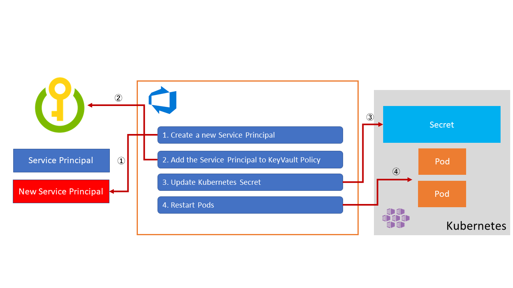
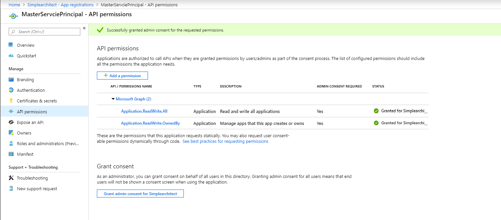
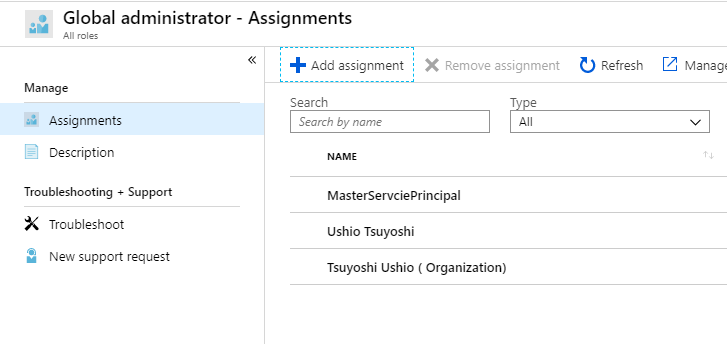

# Service Prinicipal Rotation for Key Vault

In this article, you can learn how to rotate a Servcie Principal for Key Vault.



## Create a Service Principal to create Service Prinicipal

First, you will need to create a service principal with the ability to create service principals.

* [Least privilege for a service principal to create another service principal](https://stackoverflow.com/questions/42296277/least-privilege-for-a-service-principal-to-create-another-service-principal)

* [Azure AD - create a new Service Principal programmatically](https://stackoverflow.com/questions/56408340/azure-ad-create-a-new-service-principal-programmatically)

### Create a Service Principal using CLI

Use [Azure CLI](https://docs.microsoft.com/en-us/cli/azure/install-azure-cli?view=azure-cli-latest) for [creating Service Prinicpal](https://docs.microsoft.com/en-us/cli/azure/create-an-azure-service-principal-azure-cli?view=azure-cli-latest).

It requires owner role permission to assign the role. For more details [Built-in roles for Azure resources](https://docs.microsoft.com/en-us/azure/role-based-access-control/built-in-roles#contributor).

```bash
az ad sp create-rbac --name MasterServciePrincipal --role owner
```

### Add API Permission

Go to Azure Active Directory > App registrations > {Your Service Principal Name} > API permissions.  Add API permissions. In `Microsoft Graph` `Application.ReadWrite.All` and `ApplicationReadWrite.OwnedBy`. Then grant consent.



### Add Global Administrator

Go to Azure Active Directory > Roles and administrators > Global administrator.
Add assignment to your application.



## Deploy a sample app

Deploy a sample application with [Key Vault FlexVolume](https://github.com/Azure/kubernetes-keyvault-flexvol)

### Deploy flex volume

Enable kubectl command. Refer to this [tutorial](https://docs.microsoft.com/en-us/azure/aks/kubernetes-walkthrough) for enabling kubectl.

```Bash
kubectl create -f https://raw.githubusercontent.com/Azure/kubernetes-keyvault-flexvol/master/deployment/kv-flexvol-installer.yaml
```

For more detail, you can refer to [these instructions](https://github.com/Azure/kubernetes-keyvault-flexvol).

### Create the secret

Create secret which include service prinicipal to access Key Vault from your app. To create a service principal see [here](https://docs.microsoft.com/en-us/cli/azure/create-an-azure-service-principal-azure-cli?view=azure-cli-latest#create-a-service-principal).

```Bash
kubectl create secret generic kvcreds --from-literal clientid=<CLIENTID> --from-literal clientsecret=<CLIENTSECRET> --type=azure/kv
```

### create role assignment and policy to Key Vault

```Bash
# Assign Reader Role to the service principal for your Key Vault
az role assignment create --role Reader --assignee <principalid> --scope /subscriptions/<subscriptionid>/resourcegroups/<resourcegroup>/providers/Microsoft.KeyVault/vaults/<keyvaultname>

az keyvault set-policy -n $KV_NAME --key-permissions get --spn <YOUR SPN CLIENT ID>
az keyvault set-policy -n $KV_NAME --secret-permissions get --spn <YOUR SPN CLIENT ID>
az keyvault set-policy -n $KV_NAME --certificate-permissions get --spn <YOUR SPN CLIENT ID>
```

Example _nginx.yml_

```Yaml
apiVersion: apps/v1
kind: Deployment
metadata:
  name: nginx-deployment
  labels:
    app: nginx
spec:
  replicas: 3
  selector:
    matchLabels:
      app: nginx
  template:
    metadata:
      labels:
        app: nginx
    spec:
      containers:
      - name: nginx-flex-kv
        image: nginx
        volumeMounts:
        - name: test
          mountPath: /kvmnt
          readOnly: true
      volumes:
      - name: test
        flexVolume:
          driver: "azure/kv"
          secretRef:
            name: kvcreds                             # [OPTIONAL] not required if using Pod Identity
          options:
            usepodidentity: "false"                   # [OPTIONAL] if not provided, will default to "false"
            keyvaultname: "simplekv"              # [REQUIRED] the name of the KeyVault
            keyvaultobjectnames: "hello"         # [REQUIRED] list of KeyVault object names (semi-colon separated)
            keyvaultobjectaliases: "secret.json"      # [OPTIONAL] list of KeyVault object aliases
            keyvaultobjecttypes: secret               # [REQUIRED] list of KeyVault object types: secret, key, cert
            resourcegroup: "KeyVaultSpRotation"        # [REQUIRED] the resource group of the KeyVault
            subscriptionid: "YOUR_SUBSCRIPTION_ID"                 # [REQUIRED] the subscription ID of the KeyVault
            tenantid: "YOUR_TENANT_ID"                    # [REQUIRED] the tenant ID of the KeyVault
```

Deploy the application. On portal, create a Secret named "hello" with some value. Then Apply the yaml file.

```Bash
kubectl apply -f nginx.yaml
```

Check the value of the Key Vault secret referenced on the pod.

```Bash
$ kubectl get pods
NAME                                READY   STATUS    RESTARTS   AGE
nginx-deployment-796d454c59-2rrzz   1/1     Running   0          40s
nginx-deployment-796d454c59-brqxp   1/1     Running   0          40s
nginx-deployment-796d454c59-h8zvp   1/1     Running   0          40s
$ kubectl exec -it nginx-deployment-796d454c59-2rrzz bash
root@nginx-deployment-796d454c59-2rrzz:/# ls
bin  boot  dev  etc  home  kvmnt  lib  lib64  media  mnt  opt  proc  root  run  sbin  srv  sys  tmp  usr  var
root@nginx-deployment-796d454c59-2rrzz:/# cd kvmnt/
root@nginx-deployment-796d454c59-2rrzz:/kvmnt# ls
secret.json
root@nginx-deployment-796d454c59-2rrzz:/kvmnt# cat secret.json
world
```

## Create a Service Connection for Service Principal

### Service Connection Settings for Servcie Principal

Create a service connection for the Service Principal in Azure DevOps by going to Azure DevOps > Project Settings > Servcie Connections.
Select `Azure Resource Manager`. Input the Service Principal information.

### Service Connection Settings for Kubernentes

Create a service connection for the Kubernetes Cluster.
Azure DevOps > Project Settings > Sevice Connections.
Select `Kubernetes`. Input the Kubernetes Cluster's information.

## Create a Pipeline on Azure DevOps

Following `azure-pipeline.yml` consists of four part.

1- Create a new Service Prinicpal

2- Set it to the Azure Key Vault policy

3- Restart the Pods

Example _azure-pipelines.yml_

```Yaml
trigger:
- master

pool:
  vmImage: 'ubuntu-latest'

variables:
  SubscriptionServcieEndpoint: 'MasterServicePrincipal'
  KubernetesServiceEndpoint: 'AKSCluster'
  Namespace: 'default'
  KeyVaultName: 'simplekv'
  KubernetesDeployment: 'deployment/nginx-deployment'

steps:
- task: AzureCLI@1
  displayName: 'Create and assign New Service Principal'
  inputs:
   azureSubscription: '$(SubscriptionServcieEndpoint)'
   scriptLocation: inlineScript
   inlineScript: |

     # Create a new Service Principal
     servicePrincipal=$(az ad sp create-for-rbac --name KeyVaultPrinicpal$(Build.BuildId))
     echo $servicePrincipal
     clientId=$(echo $servicePrincipal | jq '.appId')
     clientSecret=$(echo $servicePrincipal | jq '.password')

     clientId=$(echo "${clientId//\"}")
     clientSecret=$(echo "${clientSecret//\"}")

     echo $clientId
     echo $clientSecret

     # Get Scope

     keyVavult=$(az keyvault show -n $(KeyVaultName))
     keyVaultScope=$(echo $keyVavult | jq '.id')

     # Assign Role to the Servcie Principal for KeyVault
     az role assignment create --role Reader --assignee $clientId --scope $keyVaultScope

     # Set Policy to the KeyVault
     az keyvault set-policy -n $(KeyVaultName) --key-permissions get --spn $clientId
     az keyvault set-policy -n $(KeyVaultName) --secret-permissions get --spn $clientId
     az keyvault set-policy -n $(KeyVaultName) --certificate-permissions get --spn $clientId

     # Create secret file
     clientIdBase64=$(echo -n $clientId | base64)
     clientSecretBase64=$(echo -n $clientSecret | base64)
     cat <<EOF > kvcred.yml
     apiVersion: v1
     kind: Secret
     metadata:
       name: kvcred
     type: Opaque
     data:
       clientId: $clientIdBase64
       password: $clientSecretBase64
     EOF

     cat kvcred.yml
- task: Kubernetes@1
  displayName: "kubectl create secret"
  inputs:
   kubernetesServiceEndpoint: $(KubernetesServiceEndpoint)
   namespace: $(Namespace)
   command: apply
   arguments: -f kvcred.yml --record
- task: Kubernetes@1
  displayName: 'kubectl rollout restart'
  inputs:
    kubernetesServiceEndpoint: $(KubernetesServiceEndpoint)
    namespace: $(Namespace)
    command: rollout
    arguments: 'restart $(KubernetesDeployment)'
    checkLatest: true
- task: Kubernetes@1
  displayName: 'kubectl rollout status'
  inputs:
    kubernetesServiceEndpoint: $(KubernetesServiceEndpoint)
    namespace: $(Namespace)
    command: rollout
    arguments: 'status $(KubernetesDeployment)'
    checkLatest: true
```

## Considerations

This pipeline continuously creates Service Principals. You should carefully configure the expiration of the service principal. You should consider creating a script to remove expired/stale Service Principals once it has expired using [Key Vault notifications](AKS_secret_rotation_strategies.md).
