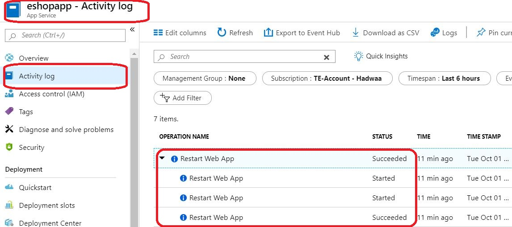

# Restart App Service

this is a short walk through to restart a deployed App Service instance to be abe to reflect any deployed changes.

## Restart the App using AZ CLI

```az cli
# Login to your AZ sunscription where App serivce is deployed
az login

# If there are multiple subscriptions for this your azure account, Set the current subscrition to the one owns the App Serive
az account set -s <YOURSUBSCRIPTIONID>

# Restart the web app
az webapp restart --name <APPNAME> --resource-group <ResourceGROUPNAME>

```

## Verify the APP successfully restarted

1- Login to Azure portal.

2- Navigate to the App service instance.

3- From the **Activity log** blade, Check a recent **Restart Web App** opertion was successfully performed on the app service.



## References

- [AZ Web APP](https://docs.microsoft.com/en-us/cli/azure/webapp?view=azure-cli-latest#az-webapp-restart)
