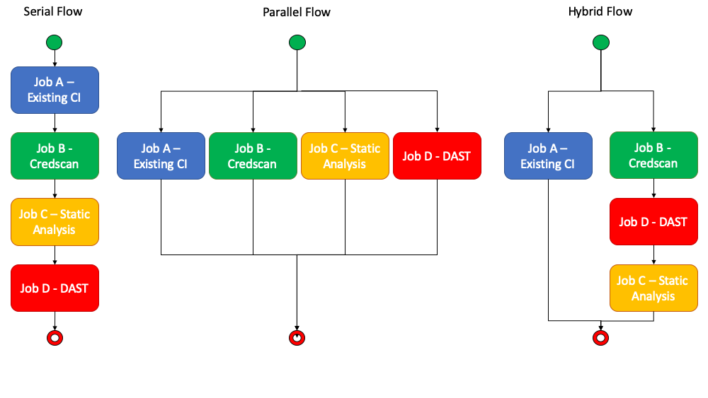

# DevSecOps Workflow

Pull request are a central activity in adopting Git and Agile based workflows that leverage Continous Integration (CI).  DevSecOps seeks to shift security left and introduces several scenarios/processes/tools needed to have broad security coverage. These additional scenarios during CI can have an impact on developer productivity.  This scenario seeks to improve/optimize workflow during Pull Request.

## Shift left (conceptually)

In the past, where teams were in a waterfall development model, security testing tended to occur during late testing/ staging phases of the development lifecycle. The concept of shifting left is to move the security testing eariler stage of development to get feedback more quickly.  In an agile delivery model that leverages Git as the version control platform, the pull request becomes a central activity for shifting task left and earlier in the cycle.


Generally, we will seek to shift most of the secnarios around DevSecops into CI that runs as part of pull request automation as it helps:

* Security Quality Gates integrated with CI
* It helps alleviate vulnerablity ever making it to the master branch
* As a developer, we want to holistically see vulnerablity reports in one place
* Developers can deliberately suppress false positives (Optional) and have those decisions as part of PR history


For the advanced scenario, we can use PR Bot to suppress false positives and create advanced work item integration. You can refer the PR bot strategy on the other document.

## WorkFlow patterns

We have developed three options for including DevSecOps scenarios into your applications development workflow.  These options provide flexibility based on not only the desired security analysis but also the resources and time needed to execute them.  Our recommendation for optimal performance is to have an agent pool with parallel job size >= 5.  The hybrid scenario works best with 2-3 parallel jobs and the serial flow is built for the scenario where you only have one agent and CI execution time is not a concern or not addressable.  To adjust the number of parallel jobs, review the documentation [here](https://docs.microsoft.com/en-us/azure/devops/pipelines/licensing/concurrent-jobs?view=azure-devops).



### Serial Flow

If you have a flow that you need to execute one by one, use the Serial folow pattern.  Fully implemented this pipeline will take approxiamately 30 minutes to fully execute on average.

### Parallel Flow

If you don't need to execute the serially, you can use the parrllel flow. This can greatly reduce execution time to 5-7 minutes.

### Hybrid Flow

Hybrid flow is a compromise on parallel jobs where you continue to run CI in its own pipeline but delegate all DevSecOps task to a secondary pipeline.  The benefit of this model is you can apply org policy effectively and reuse the DevSecOps across projects with minimal modifications potentially.  Execution time can very but is generally around 12 minutes in our test scenario.

### Enforce Policy

If you want to inject specific task for all pipeline on your organization or project, you can use this strategy.
Please refer the [Enforce policy](../EnforceOrgSecurityPolicy/README.md) Scenario Documentation.

## Configration

## Serial Flow configuration

Create multiple jobs then configrue a dependency and condition for each jobs.

If you have Job A, job B, Job C, you need to configure the dependency and condition.
Job B depends on Job A, Job C depends on JobB, also you can configure the configuration of Job B and C as "Even if a previous job has failed.


You will find a Serial Flow Pipeline sample in [here](https://dev.azure.com/csedevops/DevSecOps/_apps/hub/ms.vss-ciworkflow.build-ci-hub?_a=edit-build-definition&id=73).

## Parallel Flow configuration

Create multiple jobs. Jobs run in parallel in default.  We recommend having an agent pool with a minimum size of 4 to get the best performance out of a parellel job workflow.  This can potentially give the best performance and feedback to developers.

You will find a Parallel Flow Pipeline sample in [here](https://dev.azure.com/csedevops/DevSecOps/_apps/hub/ms.vss-ciworkflow.build-ci-hub?_a=edit-build-definition&id=71).

## Tips for the configurations

You can refer the Scanners configuration detail on this repo. This document will explain Workflow specific tips for you.

### Fail if the quality gate has failed

Scanners have a quality gate. Usually, each task has a future of fail if it doesn't reach the quality gate, however, some of them don't have the future for that.
SonarCloud is the one. In case of Sonar Cloud, you can use a task.

* [SonarCloud build breaker](https://marketplace.visualstudio.com/items?itemName=SimondeLang.sonarcloud-buildbreaker)

You can find it for SonarQube as well. For the configuration of the Sonar Cloud pipeline and PR validation, please refer [This](../StaticCodeAnalysis/SonarCloud.md) page.

### Create Work Item

If you want to create a work item when the scan is failed, you can use Create Work Item task.

* [Create Work Item](https://marketplace.visualstudio.com/items?itemName=mspremier.CreateWorkItem)

You can find a sample configuration for the task. For more detail of the configuration, please refer the link above.

```YAML
variables:
  AssignTo: 'Tsuyoshi Ushio <tsushi@microsoft.com>'

steps:
- task: CreateWorkItem@1
  displayName: 'Create work item'
  inputs:
    teamProject: DevSecOps
    workItemType: Bug
    title: 'Fossa Scan Failed: $(System.PullRequest.PullRequestId)'
    assignedTo: '$(AssignTo)'
    areaPath: 'DevSecOps\Scenarios'
    iterationPath: 'd7f2e7e9-377e-4264-8962-814b21f7fcb7@currentIteration'
    fieldMappings: 'System Info=Fossa Task failed. For more information please refer to this <a href="$(System.TeamFoundationCollectionUri)$(System.TeamProject)/_build/results?buildId=$(Build.BuildId)">link</a>'
    associate: true
    linkPR: true
    preventDuplicates: true
    keyFields: System.Title
    createOutputs: true
    outputVariables: 'CWI.Id=System.Id'
  condition: failed()
```

This task suppress to create a duplicate work item by setting `keyFields` and preventDuplicates. In this example, this task compare the Title and if it is the same, then this task doesn't create a new work item.
The title incluce the pull request id.

`condition` should be `failed` or `Only when a previous task has failed.`

One more tips is please specify the `outputVariables` as `CWI.Id=System.Id`. It enable us to get the WorkItem.Id on the subsequnt task.

**NOTE:** Currently, this task has a bug that fails when there is a work item that has the same Title name. We have a branch to fix it. However, it is going to be merged soon.

### Create a comment to PR

[Create PR Comment task](https://dev.azure.com/csedevops/DevSecOps/_git/CreatePRCommentTask?path=%2FREADME.md&version=GBfeature%2Fsimplecomment&_a=preview) will create comment as a pull request review comment.


Since this is an alpha version for internal use, we don't push it to the market place. You can use to follow this.

#### isntall tfx command

Go to [Node CLI for Azure DevOps](https://github.com/Microsoft/tfs-cli) and install the cli.

#### Login your AzureDevOps organization

Get the Personal Access Token of your Azure DevOps, then login it using the cli.

```BASH
tfx login -t {Your personal access token} -u https://{your organization name}.visualstudio.com/DefaultCollection
```

#### Upload task

```BASH
cd Task
tsc
(update the task.json version)
tfx build tasks --task-path .\Task\
```

#### Configuration

Configure comment body and condition. In some case, `CWI.Id` will be Null. Azure Pipe represent Null as ''.  more details in [here](https://stackoverflow.com/questions/56875665/how-to-deal-with-null-for-custom-condition-in-azure-pipeline?noredirect=1#comment100347634_56875665).

```JSON
and(failed(), ne(variables['CWI.Id'], ''))
```


