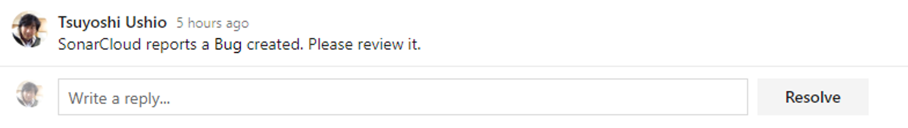

# DevSecOps Workflow

Pull request are a central activity in adopting Git and Agile based workflows that leverage Continous Integration (CI).  DevSecOps seeks to shift security left and introduces several scenarios/processes/tools needed to have broad security coverage. These additional scenarios during CI can have an impact on developer productivity.  This scenario seeks to improve/optimize workflow during Pull Request.

## Shift left (conceptually)

In the past, where teams were in a waterfall development model, security testing tended to occur during late testing/ staging phases of the development lifecycle. The concept of shifting left is to move the security testing eariler stage of development to get feedback more quickly.  In an agile delivery model that leverages Git as the version control platform, the pull request becomes a central activity for shifting task left and earlier in the cycle.


Generally, we will seek to shift most of the secnarios around DevSecops into CI that runs as part of pull request automation as it helps:

* Security Quality Gates integrated with CI
* It helps alleviate vulnerablity ever making it to the master branch
* As a developer, we want to holistically see vulnerablity reports in one place
* Developers can deliberately suppress false positives (Optional) and have those decisions as part of PR history


For the advanced scenario, we can use PR Bot to suppress false positives and create advanced work item integration. You can refer the PR bot strategy on the other document.

## WorkFlow patterns

We have developed three options for including DevSecOps scenarios into your applications development workflow.  These options provide flexibility based on not only the desired security analysis but also the resources and time needed to execute them.  Our recommendation for optimal performance is to have an agent pool with parallel job size >= 5.  The hybrid scenario works best with 2-3 parallel jobs and the serial flow is built for the scenario where you only have access to one agent and CI execution time is not a concern or not addressable.  To adjust the number of parallel jobs, review the documentation [here](https://docs.microsoft.com/en-us/azure/devops/pipelines/licensing/concurrent-jobs?view=azure-devops).


### Serial Flow

If you have a flow that you need to execute one by one, use the Serial folow pattern.  Fully implemented this pipeline will take approxiamately 30 minutes to fully execute on average.

### Parallel Flow

If you don't need to execute the serially, you can use the parrllel flow. This can greatly reduce execution time to 5-7 minutes.

### Hybrid Flow

Hybrid flow is a compromise on parallel jobs where you continue to run CI in its own pipeline but delegate all DevSecOps task to a secondary pipeline.  The benefit of this model is you can apply org policy effectively and reuse the DevSecOps across projects with minimal modifications potentially.  Execution time can very but is generally around 12 minutes in our test scenario.

### Policy Enforcement

If you want to inject specific task for all pipelines in your organization or project, you can use this strategy.
Please refer the [Enforce policy](../EnforceOrgSecurityPolicy/README.md) Scenario Documentation.

## Configration

Adding multiple sets of task to accomplish various security scenarios can complicate the feedback loop of your CI.  In order to help target feedback, we recommend adding one of two extensions.  The decision on which extension to use comes down to whether you want feedback as new work items or as comments in the PR.  It is common practice to put automation results as comments in the PR.  This allows the PR submitter to review feedback as part of the overall conversation and doesn't clutter the work item tracking system.  Use of work items is another option and we support both.  This is a decision for the team to make of what works best for them.

The work item extension is much more mature in that it allows for a flexible experience when adding additional information to the issue that was found.  The PR comments extension can drive a more natural experience where the feedback is intended to help drive resolution within the PR but the extension is somewhat basic as this time because it requires you to come up with some formatted HTML to insert in the PR comment.  We welcome feedback and code contributions to the PR comments extension should you want to help contribute.

* [PR comments extension](https://marketplace.visualstudio.com/azuredevops) - This extension is an MVP for creating comments on a pull request from your automatoin.  We welcome feedback and contributions if you see a feature that could be useful.  This extension allows you to insert HTML formatted comments in the pull request.

* [Create Work Item Extension](https://marketplace.visualstudio.com/azuredevops)

## Serial Flow Configuration

Create multiple jobs then configrue a dependency and condition for each jobs.

If you have Job A, job B, Job C, you need to configure the dependency and condition.  For example, Job B depends on Job A, and Job C depends on JobB.  In addition, you should configure the `Run this job` setting of Jobs B and C to **Even if a previous job has failed.**


You will find a Serial Flow Pipeline sample in [here](https://dev.azure.com/csedevops/DevSecOps/_apps/hub/ms.vss-ciworkflow.build-ci-hub?_a=edit-build-definition&id=73).

## Parallel Flow Configuration

This flow creates multiple jobs in Create multiple jobs. Jobs run in parallel in default.  We recommend having an agent pool with a minimum size of 4 to get the best performance out of a parellel job workflow.  This can potentially give the best performance and feedback to developers.  When setting up parallel jobs be sure not to set the [dependsOn](https://docs.microsoft.com/en-us/azure/devops/pipelines/yaml-schema?view=azure-devops&tabs=schema#job) setting.

You will find a Parallel Flow Pipeline sample in [here](https://dev.azure.com/csedevops/DevSecOps/_apps/hub/ms.vss-ciworkflow.build-ci-hub?_a=edit-build-definition&id=71).

## Hybrid Flow Configuration

This flow seeks to not touch existing CI but to add a single parallel pipeline that runs all the scenario jobs in that second pipeline.  An example of this pipeline can be found [here](https://csefy19.visualstudio.com/Strategic%20Tech%20Program/_git/DevOps_DevSecOps?path=%2Fpipelines%2FChallenge%204%2FWorkFlow%2FHybrid-CI.yml&version=GBmaster). With the addition of container reference we are also working to make the pen test a standard container that is available for addtion to the hybrid job.  We will update guidance once we have this tested and implemented.

## Tips for the configuration

### Use quality gates when available

Some of the Scanners have a quality gate task that is available for setting thresholds on whether the CI pipeline should pass/fail. SonarCloud is an example where you can set a quality gate in your CI.  Sonar cloud offers code smells for security static analysis and is a good option to consider.  The quality gate however doesn't fail the build by default.  You need to add an extension called build breaker to make this all work.  This works for both SonarCloud/SonarQube scenarios.

* [SonarCloud build breaker](https://marketplace.visualstudio.com/items?itemName=SimondeLang.sonarcloud-buildbreaker)

For configuration of Sonar Cloud pipeline and PR validation, please refer [Static Code Analysis scenario](../StaticCodeAnalysis/SonarCloud.md).

### Using Create Work Item extension

If you want to create a work item when the job has failed, you can use Create Work Item task.  This extension is useful when you want segment CI failures as a static analysis failure might go to a different team member over a dependency or pen test failure.

* [Create Work Item](https://marketplace.visualstudio.com/items?itemName=mspremier.CreateWorkItem)

Below is a sample configuration for the task. Note the linkPR value.  Setting this value to true will automatically link the work item to the pull request if the CI was initiated via pull request as part of your [branch policy](https://docs.microsoft.com/en-us/azure/devops/repos/git/branch-policies?view=azure-devops).

```YAML
variables:
  AssignTo: 'team member <teammember@microsoft.com>'

steps:
- task: CreateWorkItem@1
  displayName: 'Create work item'
  inputs:
    teamProject: DevSecOps
    workItemType: Bug
    title: 'Fossa Scan Failed: $(System.PullRequest.PullRequestId)'
    assignedTo: '$(AssignTo)'
    areaPath: 'DevSecOps\Scenarios'
    iterationPath: 'd7f2e7e9-377e-4264-8962-814b21f7fcb7@currentIteration'
    fieldMappings: 'System Info=Fossa Task failed. For more information please refer to this <a href="$(System.TeamFoundationCollectionUri)$(System.TeamProject)/_build/results?buildId=$(Build.BuildId)">link</a>'
    associate: true
    linkPR: true
    preventDuplicates: true
    keyFields: System.Title
    createOutputs: true
    outputVariables: 'CWI.Id=System.Id'
  condition: failed()
```

This task also attempts to suppress the creation of a duplicate work item by `preventDuplicates` to true and setting `keyFields` to a work item field to key duplicate detection off of. In this example, the task compares the work item `Title` field.  A good best practice is to add the pull request ID to the title field as is done in the example above, `Fossa Scan Failed: $(System.PullRequest.PullRequestId)`.  This means a duplicate bug will not be created for the same issue in the same pull request.


`condition` should be `failed` or `Only when a previous task has failed.`

Finally, set the `outputVariables` to `CWI.Id=System.Id`.  Doing so, enables subsequnt task to get the WorkItem Id.

### Using PR Comments extension

[Create PR Comment task](https://dev.azure.com/csedevops/DevSecOps/_git/CreatePRCommentTask?path=%2FREADME.md&version=GBfeature%2Fsimplecomment&_a=preview) will create comment as a pull request review comment.



#### Configuration

Configure comment body and condition. In some case, `CWI.Id` will be Null. Azure Pipe represent Null as ''.  more details in [here](https://stackoverflow.com/questions/56875665/how-to-deal-with-null-for-custom-condition-in-azure-pipeline?noredirect=1#comment100347634_56875665).

```JSON
and(failed(), ne(variables['CWI.Id'], ''))
```


