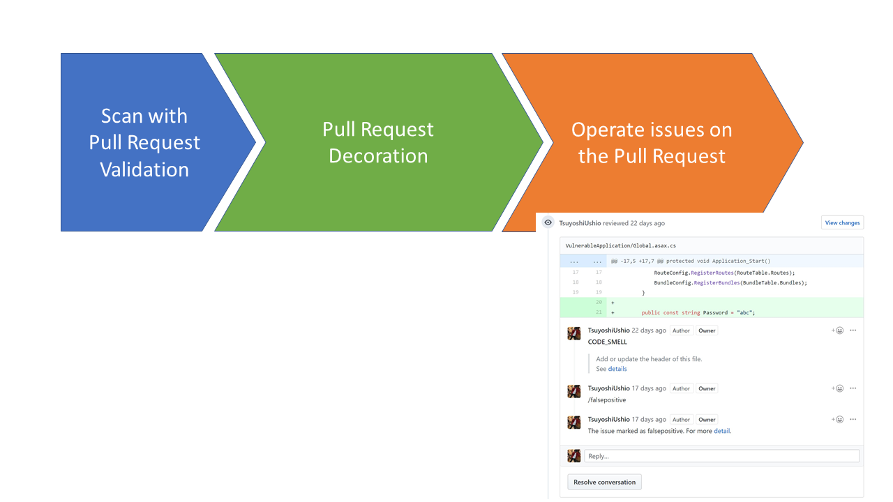
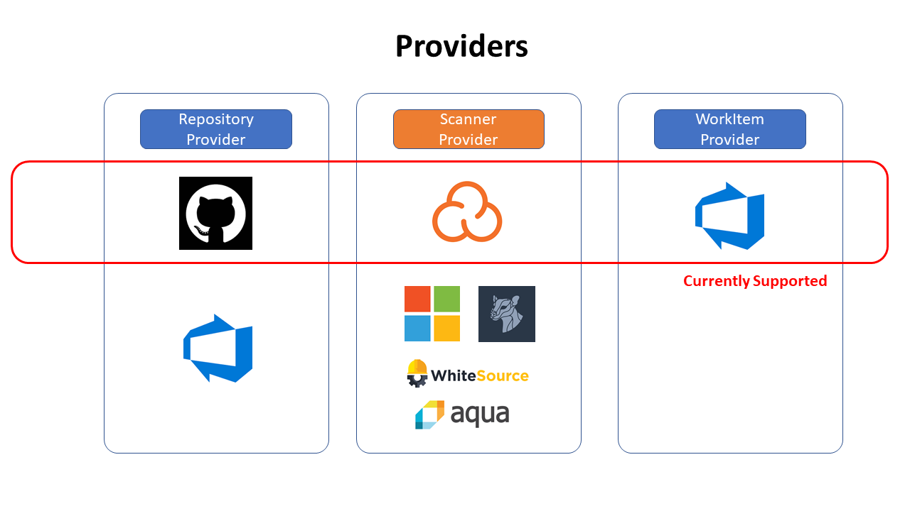

# Serucity Bot

Security Bot is a reference implementation of the DevSecOps Pull Request centered validation, operation system. 

You can see the demo. Click the image.

## Issue to solve 

What we found through DevSecOps engagement is 

* Scan result is scattered on each 3rd party scanning portal
* How to suppress false-positives?
* How can we create a work item? 

This reference solution solve all of these problem. 

## General Idea 

The general idea of the Security Bot is, through the Pull Request Validation, we can scan source code and find several issues produced by several 3rd party services.
This bot will decorate the pull request with all of these issues as pull request comments that will need to be resolved in order for the merge to be approved. It centralizes the issue/s on a Pull Request so that a developer can handle all of the issues in one place. You can also invoke a command by just replying to a comment. e.g. suppressing false-positives or creating work items by replying "suppress false positive" or "create work item".
It can help developers and handle all of the security issue in one place.

## Reference implementation

We developed a reference implementation on GitHub.

* [TsuyoshiUshio/SecurityBot](https://github.com/TsuyoshiUshio/SecurityBot)

This bot is implemented by C# Azure Functions. You can deploy it to Azure with one click from the repository. It is deployed as a Consumption plan which is pay-per-use.
It only requires a Storage Account with Security tools access tokens. For more details, you can take a look at the repo. The bot has a good extension mechanism. It uses Providers and therefore it is easy to extend by creating a new provider for the tool that you would like to support.

### Install

Go to the [GitHub project page](https://github.com/TsuyoshiUshio/SecurityBot) then click Deploy to Azure button. 

### Current support status

Currently, we implement three providers. For repository, we can use GitHub, For scanner, we can use Sonar Cloud, and WorkItem, We can use Azure DevOps. However, you can add provider without changing the main code. 

### Architecture 

The Security Bot save the state to a storage account using [Durable Entity]().

Sample Pipeline to decorate PR. 
* [SonarCloudWithGitHub](https://dev.azure.com/csedevops/DevSecOps/_apps/hub/ms.vss-ciworkflow.build-ci-hub?_a=edit-build-definition&id=69)
